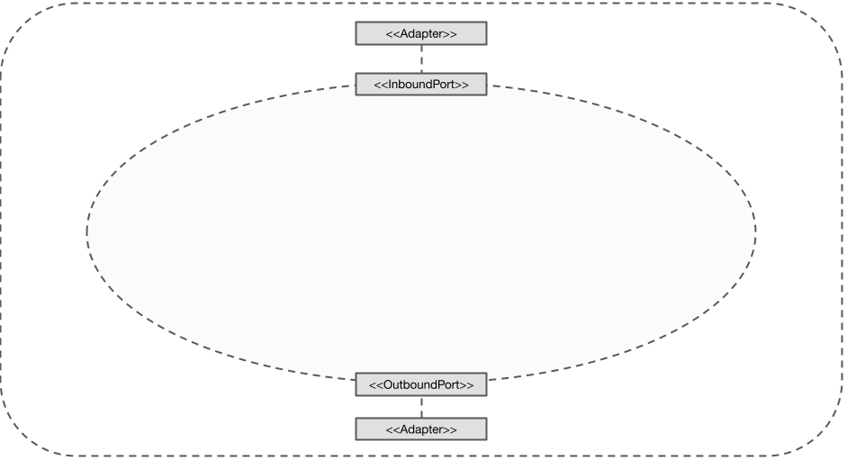
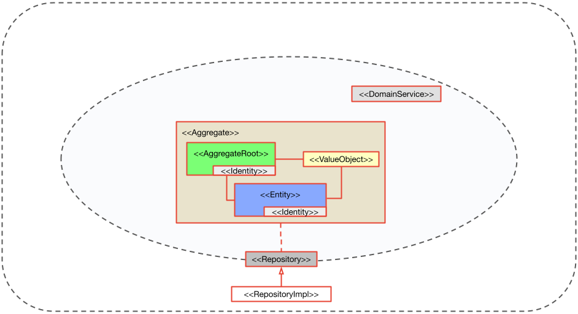
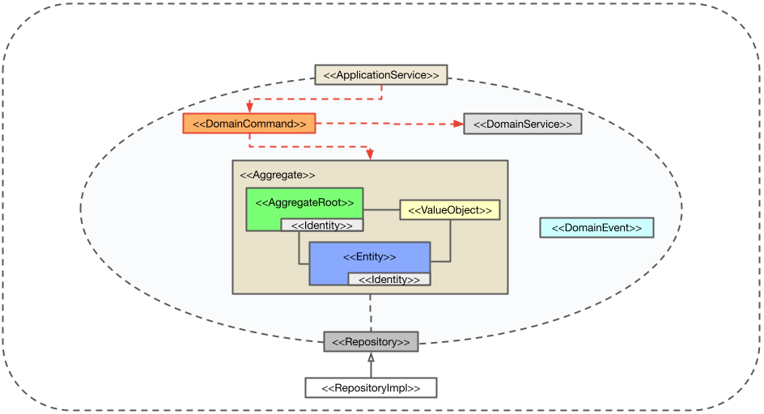

## DLC Architecture Considerations
The following diagram provides an overview of all the concepts supported by DomainLifeCycles (DLC). 
If you're familiar with tactical Domain-Driven Design (DDD), you'll recognize many of the standard building blocks. 
However, the diagram also includes additional concepts that may be less familiar. 
In the following sections, we’ll walk through each concept step by step.


### Basics: Domain Isolation


This diagram illustrates the architectural separation of concerns in a system designed
recommended when using tactical Domain-Driven Design (DDD). It is explicitly supported by DomainLifeCycles (DLC).

- Outer Rectangle (Dashed Border):
  Represents the application boundary — the complete system context. 
  It includes all layers, from user interaction and domain logic to infrastructure components 
  such as databases and external services.
- Inner Ellipse (Dashed Border):
  Denotes the core domain layer, which encapsulates the essential business logic. 
  This is where Aggregates, Entities, Value Objects, Domain Events, and Domain Services reside 
  — the building blocks of your domain model.

### Basics: Ports & Adapters



Introducing ports and adapters help to enforce a clean boundary between the core domain logic and the infrastructure or application logic.
By introducing these components:
- Ports define what the domain needs or offers, without knowing how it's used or implemented.
- Adapters handle the actual communication with the outside world (like web APIs or databases).

This clear separation keeps the core logic clean, independent, and easy to test or change. Later on, you will see specific kinds of ports that are recommended for using the Ports and Adapters pattern in combination with DDD.

### Typical DDD Building Blocks



DLC operates at the class level to bring clarity and structure to your domain model.
The basic idea is to make it explicit and transparent which tactical DDD concept (like Aggregate Root, Entity, Value Object, etc.) a particular class represents.
To achieve this, DLC uses marker interfaces — simple interfaces with no methods — that are applied directly to domain classes.
Example:
```java
public class Order implements AggregateRoot { ... }
```
```java
public class Product implements Entity { ... }
```
```java
public class Address implements ValueObject { ... }
```
By tagging each class with a relevant marker interface, DLC helps make the intent of each class clear, such as indicating that a class represents an Aggregate Root. It also supports consistent modeling across the domain and enables tooling or validation to recognize and work with these roles effectively.This approach keeps the domain model expressive and structured, while staying lightweight and non-intrusive.
DLC supports:
- AggregateRoot (green): Entry point to the aggregate; enforces consistency rules.
- Entity (blue): Has a distinct identity and lifecycle.
- ValueObject (yellow): Immutable and defined by its attributes.
- Identity: Used by entities and aggregate roots for unique identification.
- DomainService (gray): Encapsulates domain logic that doesn't naturally fit within entities or value objects.
- Repository (gray): Abstracts data access to aggregates.

In terms of Ports and Adapters the repository interface is a port. 
The domain logic only depends on the Repository port (interface). 
There is an implementation residing outside the domain logic, talking to the actual database.


It is common for a DomainService to call Repositories in order to access Aggregates.

### ApplicationServices

An ApplicationService (beige) coordinates use cases by delegating tasks to Aggregates, Repositories and other components. 
In Hexagonal Architecture (aka Ports and Adapters), Application Services are considered an inbound port (or driver) that 
receives requests from external clients and directs them into the domain. 
The terms Application Service and Driver essentially represent the same concept.

")

In terms of DDD, it is perfectly acceptable for an Application Service to call a Repository directly or to invoke a DomainService, 
as it orchestrates the application’s workflow.


### DomainEvents

A DomainEvent (light blue) represents a significant occurrence within the domain.


Aggregates can emit DomainEvents as part of their business logic to notify other parts of the system when something important happens. 
DLC also supports Aggregates that listen directly to DomainEvents.

DomainServices can listen for DomainEvents to respond to changes that occur within Aggregates 
or elsewhere in the domain. They may also raise DomainEvents themselves if their business logic causes significant domain changes.

As mentioned, ApplicationServices orchestrate use cases and coordinate interactions between domain objects and infrastructure. 
They typically listen for DomainEvents to trigger side effects, such as sending notifications, updating read models, or integrating with external systems. 

### DomainCommands

Domain Commands represent intentions or requests to perform specific actions within the domain. 



They typically carry the information necessary to trigger a change or behavior in the domain model. 
Commands are usually named using imperative verbs, such as ```CreateOrder```, ```ApprovePayment```, or ```CancelReservation```.

ApplicationServices often serve as the entry point for handling DomainCommands. They receive commands from external clients (e.g., UI, APIs) 
and coordinate the execution of the requested actions. ApplicationServices load the relevant aggregates, and delegate the execution of business logic to the Aggregates or DomainServices.

Aggregates are the primary handlers of DomainCommands. 
Upon receiving a DomainCommand, an Aggregate applies domain logic to determine whether and how its state should change. 
The Aggregate enforces invariants and business rules in response to DommainCommands. 
If the DomainCommand is valid, the Aggregate updates its state and may produce DomainEvents to signal what has occurred.

DomainServices may also handle DomainCommands, particularly when the logic involves multiple Aggregates or does not naturally belong within a single Aggregate. 
They act on DomainCommands by coordinating complex domain logic and interactions. Like Aggregates, DomainServices enforce business rules and can raise DomainEvents 
as a result of processing DomainCommands.

It is perfectly acceptable to implement commands as method calls. DLC recommends wrapping command parameters within a DomainCommand class, 
so that the class represents the command’s intention (but not its logic) and can be passed through the system. 
DLC also recognizes methods that accept only a DomainCommand object as command handlers.

### ReadModels and QueryHandlers

QueryHandler (gray) handle read or query use cases, typically by accessing the ReadModel.
A ReadModel (pink) is an optimized, read-only data model designed specifically for querying purposes.


Although ReadModels and QueryHandlers are not traditional concepts within Domain-Driven Design (DDD), 
some read-only use cases are better served by using ReadModels rather than Aggregates. 
This approach aligns with the CQRS (Command Query Responsibility Segregation) pattern, 
which separates the write model (handling commands and business logic) from the read model (optimized for queries).

However, it is important to emphasize that ReadModels are strictly read-only. Also ReadModels should not be used for every read use case. 
Aggregates remain the authoritative source for domain state, especially when consistency and business rules need to be enforced.

In this architecture, a QueryHandler acts as an outbound port to access a ReadModel, similar to how a Repository provides 
access to Aggregates for write operations. The QueryHandler abstracts the details of querying the ReadModel, allowing the application to retrieve data efficiently.
In DLC, the ReadModel is considered part of the domain logic, as it represents domain-specific read concerns.


Additionally, ApplicationServices can call QueryHandlers directly in cases where special or complex read use cases require optimized data access. 
There are also scenarios where a DomainService may need to read information that is more easily provided by a dedicated ReadModel. 
In such cases, the DomainService can invoke a QueryHandler to retrieve the necessary data.

### OutboundServices

OutboundServices (gray) represent interfaces responsible for communicating with external systems outside the application’s domain boundary. 
Examples include sending messages to external APIs, calling third-party services, or integrating with external databases.


From the Ports and Adapters (Hexagonal) perspective, an OutboundService functions as an outbound port — 
that is, an interface defined by the domain or application layer to express interactions with external systems. 
The implementation (OutboundServiceImpl) acts as the adapter that performs the actual communication.

Outbound services are typically used when domain logic triggers interactions with external systems in a synchronous manner,
meaning the domain expects a direct response or outcome from the external call before proceeding.


There are use cases where either an ApplicationService or a Domain Service calls an OutboundService.
When an ApplicationService calls an OutboundService, it typically orchestrates a use case that involves interacting with 
external systems—such as sending notifications, calling third-party APIs, or integrating with external resources—after coordinating domain operations.

In some cases, a DomainService may also call an OutboundService directly, especially when the domain logic itself requires 
synchronous interaction with an external system as part of enforcing business rules or performing domain-specific tasks.

In both scenarios, the OutboundService acts as an outbound port in the Ports and Adapters architecture, 
abstracting the external communication so that the domain and application layers remain decoupled from infrastructure details.

## DDD Building Blocks

DLC provides marker interfaces and abstract base classes for several DDD Building Blocks. Not each
of the Building Block patterns presented here, has its origin in Evans' Blue Book. We've added some
other patterns, that were discussed by other authors and the DDD community in general.
So finally, this is an opinionated mix of patterns, that could be used to create a rich tactical design
of an application's target domain.

Some people might call those patterns rather heuristics due to the fact, that there is in many cases some uncertainty
when to apply them (or when to apply which of them) to get the best results. In our opinion DDD should be applied,
so that finally the implementation expresses our domain model in an appropriate way. DLC should help thereby
to express that model by using natural possibilities of Java, but without letting restrictions or technical requirements
of other frameworks weaken the expressiveness of our model.

So in the following sections, you will find a brief description of the patterns supported as well as implementation
suggestions using DLC.

The classic DDD Building Blocks supported by DLC are:

- [ValueObject](#ValueObject)
- [Entity](#Entity)
- [Aggregate](#Aggregate)
- [Identity](#Identity)
- [Repository](#Repository)
- [DomainService](#DomainService)
- [DomainEvent](#DomainEvent)

Parts of the structures defined by those type interfaces are inspired by the JMolecules
project: https://github.com/xmolecules/jmolecules/tree/main/jmolecules-ddd.

Additionally, DLC provides support for supplementary Building Blocks / patterns often used, when tactical DDD is
applied:

- [DomainCommand](#DomainCommand)
- [ApplicationService](#ApplicationService)
- [ReadModel](#ReadModel)
- [QueryHandler](#QueryHandler)
- [OutboundService](#OutboundService)

We encourage the implementation of "always-valid" domain objects, so all non-service building blocks
are [Validatable](#Validatable).
More information on always-valid can be found [here](validation-extender/readme_validation.md)

Also take a look at our [general considerations](#general-considerations) on using `java.lang.Optional` on fields.

<a name="ValueObject"></a>

## ValueObject

### Pattern description

ValueObjects represent typed values that describe or compute a characteristic of a thing. ValueObjects have no
conceptional identity and no lifecycle.
They can help writing better code which is less error-prone and more expressive than basic Java types. ValueObjects
are characterized by:

- Value equality (ValueObjects are equal, if all contained values are equal)
- Immutability (once created the internal state of ValueObjects should not change)
- Self-validation (a ValueObject should only be created in valid state, regarding its invariants or applicable domain
  rules, see [Validatable](#Validatable))

Further
information: [Design Reference - Value Objects](https://www.domainlanguage.com/wp-content/uploads/2016/05/DDD_Reference_2015-03.pdf)

### Implementation suggestions with DLC

+ All ValueObjects must implement `io.domainlifecycles.domain.types.ValueObject` (except of Enums, see below).
+ ValueObjects should be immutable, so we suggest declaring all internal properties `final`
  (or using Lomboks `@Value`).
+ References to Aggregates or Entities should never be a direct Java object reference, instead we suggest
  using references by id (as described in Vaughn Vernon's Red Book).
+ We suggest to take care of appropriate `equals` and `hashCode` implementations. If ValueObjects are implemented as
  regular Java classes
  using DLCs `io.domainlifecycles.domain.types.base.ValueObjectBase` or as Java records, automatically correct `equals`
  and `hashCode` will be provided.
+ Since Java 17, we suggest that ValueObjects should be declared as Java records (`java.lang.Record`).
+ ValueObjects, that are expressed as Java Enums must not implement `io.domainlifecycles.domain.types.ValueObject`
  (even though from a DDD Building Block perspective they fulfill all required characteristics of a ValueObject).
+ We encourage the programmer to put as much logic as possible into methods declared inside a ValueObject.

### Example

```Java
@Builder
public record Price(
    @NotNull @PositiveOrZero @Digits(integer = 10, fraction = 2) BigDecimal amount
    ) implements ValueObject
{
    public Price add(Price another){
        return new Price(amount.add(another.amount));
    }

    public Price multiply(int factor){
        return new Price(amount.multiply(BigDecimal.valueOf(factor)));
    }

}
```

<a name="Entity"></a>

## Entity

### Pattern description

Typically, there are also "things" in our domain, that have a lifecycle and whose attributes possibly
change over time. Those "things" are called Entities. Entities are tied to the concept of Identity.
They must be differed, even if they carry the same values in their attributes. Therefore, the Identity is used.

Further
Information: [Design Reference - Entities](https://www.domainlanguage.com/wp-content/uploads/2016/05/DDD_Reference_2015-03.pdf)

### Implementation suggestions with DLC

+ Entities should implement domain logic and behaviour in an object-oriented way.
  Domain logic that refers only to an Entity should be implemented within the Entity not in services.
+ DLC requires Entities to implement `io.domainlifecycles.domain.types.Entity`.
+ We suggest to take care of appropriate `equals` and `hashCode` implementations, to depend only on the Entities
  Identity.
  If Entities are implemented using DLCs `io.domainlifecycles.domain.types.base.EntityBase` automatically
  correct `equals` and `hashCode` are provided.
+ Entities should take care to stay valid in terms of domain rules and their invariants. Therefore,
  we suggest implementing them in a self-validating manner (see [Validatable](#Validatable)).
+ Prefer ValueObjects to express the Entities attributes over basic Java types.

### Example

```Java
@Getter
public final class OrderItem extends EntityBase<OrderItem.OrderItemId> {

    public record OrderItemId(@NotNull Long value) implements Identity<Long> { }
    
    private final OrderItemId id;

    @NotNull
    private final Product.ProductId productId;

    @NotNull
    private final Price productPrice;

    @PositiveOrZero
    private int quantity;
    
    @Builder
    private OrderItem(final long concurrencyVersion,
                      final OrderItem.OrderItemId id,
                      final Product.ProductId productId,
                      final Price productPrice,
                      final int quantity) {
        super(concurrencyVersion);
        this.id = id;
        this.productId = productId;
        this.productPrice = productPrice;
        this.quantity = quantity;
    }
    
    public Price itemPrice() {
        return productPrice.multiply(quantity);
    }
    
    public OrderItem addQuantity(int quantity){
        this.quantity += quantity;
        return this;
    }

}
```

<a name="Aggregate"></a>

## Aggregate

### Pattern description

An Aggregate is a group of Entities and ValueObjects, which should be handled as a coherent unit.
That group of objects has a strong coupling regarding their consistency requirements, which are better
maintained, if that group of objects is handled as a conceptual whole.

One Entity of the Aggregate must be chosen as the AggregateRoot, which becomes the entry point of all interactions
with the defined Aggregate. The Aggregate boundary should be aligned with transactional boundaries.
That means Aggregates are always created and modified as a whole, accessing its inner state always coming from the root.

Further
Information:

- [Design Reference - Aggregates](https://www.domainlanguage.com/wp-content/uploads/2016/05/DDD_Reference_2015-03.pdf)
- [Effective Aggregate Design 1](https://www.dddcommunity.org/wp-content/uploads/files/pdf_articles/Vernon_2011_1.pdf)
- [Effective Aggregate Design 2](https://www.dddcommunity.org/wp-content/uploads/files/pdf_articles/Vernon_2011_2.pdf)
- [Effective Aggregate Design 3](https://www.dddcommunity.org/wp-content/uploads/files/pdf_articles/Vernon_2011_3.pdf)

### Implementation suggestions with DLC

+ DLC requires AggregateRoots to implement `io.domainlifecycles.domain.types.AggregateRoot`.
+ All other implementation suggestions for Entities also apply to AggregateRoots, because AggregateRoots are Entities
  themselves.
+ DLC requires appropriate `equals` and `hashCode` implementations. They must depend only on the AggregateRoots
  Identity.
  If Entities are implemented using `io.domainlifecycles.domain.types.base.AggregateRootBase` automatically
  correct `equals` and `hashCode` are provided.
+ Never reference Aggregates or their internals form other Aggregates as Java Object references.
  Always use references by Identity (Id references).

### Example

```Java
@Getter
public final class Order extends AggregateRootBase<Order.OrderId> {
    
    public record OrderId(@NotNull Long value) implements Identity<Long> {}

    private final OrderId id;

    @NotNull
    private final Customer.CustomerId customerId;

    private final Instant creation;

    @NotNull
    private final List<OrderItem> items;

    @NotNull
    private OrderStatus status;
    
    @Builder
    private Order(final long concurrencyVersion,
                  final Order.OrderId id,
                  final Customer.CustomerId customerId,
                  final OrderStatus status,
                  final Instant creation,
                  final List<OrderItem> items) {
        super(concurrencyVersion);
        this.id = id;
        this.customerId = customerId;
        this.creation = creation;
        this.status = status;
        this.items = items;
    }

    public Price totalPrice() {
        return items()
                .map(OrderItem::itemPrice)
                .reduce(new Price(BigDecimal.ZERO), Price::add);
    }
    
    public Stream<OrderItem> items() {
        return items.stream();
    }
    
    public Order add(final Product.ProductId id) {
        return addItem(id, 1);
    }
    
    public Order addItem(@NotNull final Product.ProductId id, @Positive final int quantity) {
        items().filter(item -> item.getProductId().equals(id))
                .findFirst().ifPresentOrElse(
                        item -> item.addQuantity(quantity),
                        () -> items.add(OrderItem.builder().setProductId(id).setQuantity(quantity).build())
                );
        return this;
    }
    
    public boolean hasStatus(final OrderStatus status) {
        return this.status == status;
    }
    
    public Order cancel() {
        return transition(OrderStatus.PENDING, OrderStatus.CANCELED,
                "Can't cancel an order that is not pending.");
    }
    
    public Order ship() {
        return transition(OrderStatus.PENDING, OrderStatus.SHIPPED,
                "Can't mark as shipped an order that is not pending.");
    }

    private Order transition(final OrderStatus required, final OrderStatus next, final String errorMessage) {
        DomainAssertions.notEquals(this.status, required, errorMessage);
        this.status = next;
        return this;
    }

}
```

<a name="Aggregate"></a>

## Identity

### Pattern description

DLC works with typed Identities. Every Entity must have an Identity by definition.
All Identities must be declared as specified types, following the ideas of Vaughn Vernons' Red Book.

Further information:

- [Typed Identities](https://medium.com/@gara.mohamed/domain-driven-design-the-identifier-type-pattern-d86fd3c128b3)
- [Identity within relational datastores](https://enterprisecraftsmanship.com/posts/entity-identity-vs-database-primary-key/)

### Implementation suggestions with DLC

+ Identities should behave like ValueObjects concerning immutability, value equality and self-validation.
+ DLC requires Identities to implement `io.domainlifecycles.domain.types.Identity`.
+ DLC currently only supports single-valued Identities, that means each Identity must have exactly one
  property carrying the Identities value.
+ We suggest implementing Identities as Java records (`java.lang.Record`) alongside with the Entity in an embedded
  manner.

### Example

```Java
public record OrderId(@NotNull Long value) implements Identity<Long> {}
```

<a name="Repository"></a>

## Repository

### Pattern description

A Repository is responsible for accessing Aggregates from the datastore. It provides methods to query,
insert, modify or delete Aggregates. Repositories help to hide datastore specific complexity and thus keep
the domain implementation clean and unaffected by requirements of the underlying datastore technology.

Further
Information: [Design Reference - Repositories](https://www.domainlanguage.com/wp-content/uploads/2016/05/DDD_Reference_2015-03.pdf)

### Implementation suggestions with DLC

+ DLC requires Repositories to implement `io.domainlifecycles.domain.types.Repository`.
+ Keep application logic focused on the model, delegating all object storage and access to the Repositories.
+ Make sure Repository operations do not break the Aggregate`s consistency rules,
  e.g. load only parts of an Aggregate or update parts of an Aggregate without concurrency control.
+ In many cases, DLC does not require explicitly defined mappers to map domain objects to the datastore's structure
  (for further information refer to [DLC Persistence](persistence/readme_persistence.md)).

### Example

```Java
public interface OrderRepository extends Repository<Order> {
    
    Order.OrderId newOrderId();
    
    OrderItem.OrderItemId newOrderItemId();
    
    Optional<Order> find(Order.OrderId id);
    
    Stream<Order> find(int offset, int limit, OrderStatus... orderStatus);
    
    Order insert(Order entity);
    
    Order update(Order entity);
}
```

```Java
@Repository
class JooqOrderRepository extends JooqAggregateRepository<Order, Order.OrderId> implements OrderRepository {
    
    public JooqOrderRepository(DSLContext dslContext,
                               JooqDomainPersistenceProvider domainPersistenceProvider,
                               SpringPersistenceEventPublisher persistenceEventPublisher) {
        super(Order.class, dslContext, domainPersistenceProvider, persistenceEventPublisher);
    }

    @Override
    public Order.OrderId newOrderId() {
        return new Order.OrderId(dslContext.nextval(Sequences.ORDER_ID_SEQ));
    }

    @Override
    public OrderItem.OrderItemId newOrderItemId() {
        return new OrderItem.OrderItemId(dslContext.nextval(Sequences.ORDER_ITEM_ID_SEQ));
    }

    @Override
    public Optional<Order> find(final Order.OrderId id) {
        return getFetcher().fetchDeep(id).resultValue();
    }

    @Override
    public Stream<Order> find(int offset, int limit, OrderStatus... orderStatuses) {
        Condition condition = trueCondition();
        if(orderStatuses != null && orderStatuses.length>0){
            condition = ORDER.STATUS.in(Arrays.stream(orderStatuses).map(s -> s.name()).toList());
        }
        return dslContext
                .selectFrom(ORDER)
                .where(condition)
                .orderBy(ORDER.ID)
                .offset(offset)
                .limit(limit)
                .fetch()
                .stream()
                .map(or -> getFetcher().fetchDeep(or).resultValue().orElseThrow());
    }

}
```

<a name="DomainService"></a>

## DomainService

### Pattern description

Some concepts from the domain aren’t natural to model as objects. Especially, if domain functionality cannot be
properly expressed as the responsibility of exactly one Aggregate.

In contrast to ApplicationServices (which are not directly part of the domain) DomainServices do handle domain logic
that
is often dependent on the state of multiple Aggregates.

Further
Information:

- [Design Reference - Services](https://www.domainlanguage.com/wp-content/uploads/2016/05/DDD_Reference_2015-03.pdf)
- [ApplicationServices vs. DomainServices](https://enterprisecraftsmanship.com/posts/domain-vs-application-services/)

### Implementation suggestions with DLC

+ DLC requires DomainServices to implement `io.domainlifecycles.domain.types.DomainService`.
+ Ideally a DomainService should only call write operations on at most one Aggregate/Repository.
  If other Aggregates have to be modified by the same service operation, think of using DomainEvents instead.

### Example

```Java
public interface OrderPlacementOperations extends DomainService {
    
    Order placeOrder(PlaceOrder placeOrder);

}
```

```Java
public final class OrderPlacementService implements OrderPlacementOperations {

    private final OrderRepository orderRepository;

    private final ProductRepository productRepository;

    
    public OrderPlacementService(final OrderRepository orderRepository,
                                 final ProductRepository productRepository) {
        this.orderRepository = orderRepository;
        this.productRepository = productRepository;
    }
    
    @Override
    @Publishes(domainEventTypes = {NewOrderPlaced.class})
    public Order placeOrder(final PlaceOrder placeOrder) {
        var placed = orderRepository.insert(
                Order.builder()
                        .setId(orderRepository.newOrderId())
                        .setCustomerId(placeOrder.customerId())
                        .setStatus(OrderStatus.PENDING)
                        .setCreation(Instant.now())
                        .setItems(
                                placeOrder.items()
                                        .stream()
                                        .map(item ->
                                                OrderItem
                                                        .builder()
                                                        .setId(orderRepository.newOrderItemId())
                                                        .setProductId(item.productId())
                                                        .setQuantity(item.quantity())
                                                        .setProductPrice(
                                                                productRepository
                                                                        .find(item.productId())
                                                                        .map(Product::getPrice)
                                                                        .orElseThrow(() -> new IllegalArgumentException(
                                                                                String.format("ProductId '%s' is not present in database!", item.productId()))
                                                                        )
                                                        )
                                                        .build()
                                        ).collect(Collectors.toList()))
                        .build()
        );
        DomainEvents.publish(new NewOrderPlaced(placed));
        return placed;
    }

}
```

<a name="DomainEvent"></a>

## DomainEvent

### Pattern description

DomainEvents are used to express something happened, that domain experts care about.
DomainEvents are often used to express domain rules, in form of a choreography:
"When the event A happened, then typically B has to do something". That way DomainEvents enable a good
separation of concerns for different Aggregates playing together with lesser coupling between them.
DomainEvents can be combined with techniques like Event Sourcing or CQRS, to be able to work with an explicit history
of what happened in the domain (audit trail) or to improve performance and scalability of the system.
Apart from pure technical advantages, the use of DomainEvents makes important side effects explicit within the domain
and thus improves the readability and understandability of the code.

Further
Information:

- [Design Reference - Domain Events](https://www.domainlanguage.com/wp-content/uploads/2016/05/DDD_Reference_2015-03.pdf)
- [Microsoft DotNet Patterns (not Java but the concepts are described in a very nice way)](https://learn.microsoft.com/de-de/dotnet/architecture/microservices/microservice-ddd-cqrs-patterns/domain-events-design-implementation)

### Implementation suggestions with DLC

+ DomainEvents should be named in a meaningful way (noun + verb in past tense).
+ DomainEvents require implementing `io.domainlifecycles.domain.types.DomainEvent`.
+ DomainEvents should be implemented immutable (like ValueObjects). We suggest using Java records.
+ Consider using [`DLC Domain Events`](domain-events-core/readme_domain_events.md) for appropriate transactional DomainEvent handling.

### Example

```Java
public record OrderShipped(
        @NotNull Order order
) implements DomainEvent { }
```

<a name="DomainCommand"></a>

## DomainCommand

### Pattern description

DomainCommands should be used to express that someone (e.g. a user or an external system) wishes that something should
happen in the domain.
DomainCommands can be rejected (in contrast to DomainEvents). DomainCommands play an important role in the modification
of Aggregates.
They protect Aggregate boundaries, because command handlers only allow distinct mutations on Aggregates in contrast to,
for example,
services with general `update(MyAggregate a)` methods. Moreover, they improve the readability and understandability of
the code,
because they explicitly describe the intentions of actions that can be requested and generally performed on Aggregates.
Furthermore, they can reduce the amount of parameters needed at methods that implement the corresponding action.

Further
Information:

- [Domain Command Patterns - Handlers](https://jimmybogard.com/domain-command-patterns-handlers/)

### Implementation suggestions with DLC

+ DomainCommands should be named in a meaningful way (imperative + noun).
+ DomainCommands require implementing `io.domainlifecycles.domain.types.DomainCommand`.
+ DomainCommands should be implemented immutable (like ValueObjects). We suggest using Java records.
+ DomainCommand are not to be confused with the GOF "Command Object" pattern, as we suggest not to implement
  an explicit `execute()` method within the command class. Rather, we suggest implementing the corresponding domain
  logic
  in a command handler (e.g. DomainService) or at best, push the domain logic down in the corresponding Aggregates.

### Example

```Java
public record ShipOrder(
        @NotNull Order.OrderId orderId
) implements DomainCommand {}
```

## <a name="ApplicationService"></a>ApplicationService

### Pattern description

ApplicationServices (sometimes called Driver, see "Ports & Adapters") should be used
as a slim layer between the application and the core domain logic. They are not part of the core domain.
They handle the flow of use cases, including any additional (pure technical) concerns needed on top of the domain's
logic.

Further information:

- [ApplicationServices vs. DomainServices](https://enterprisecraftsmanship.com/posts/domain-vs-application-services/)

### Implementation suggestions with DLC

+ Drivers/ApplicationServices should implement `io.domainlifecycles.domain.types.ApplicationService`
  or `io.domainlifecycles.domain.types.Driver`.
+ Make sure not to mix up or get confused about ApplicationServices and DomainServices.
+ Keep the Drivers/ApplicationServices slim.
+ Make sure Drivers/ApplicationServices do not contain any domain logic. No domain specific decisions should be
  implemented here,
  only orchestration to domain logic in Aggregates or DomainServices (or OutboundServices or QueryHandlers).

### Example

```Java
@Service
@Transactional
public class OrderService implements OrderDriver {

    private final OrderPlacementService orderPlacementService;

    private final OrderRepository orderRepository;

    public OrderService(
            final OrderPlacementService orderPlacementService,
            final OrderRepository orderRepository
    ) {
        this.orderPlacementService = orderPlacementService;
        this.orderRepository = orderRepository;
    }
    
    @Override
    public Optional<Order> cancel(CancelOrder cancelOrder){
        var canceled = orderRepository
                .findById(cancelOrder.orderId())
                .map(order ->
                        orderRepository.update(order.cancel())
                );
        return canceled;
    }
    
    @Override
    public Optional<Order> ship(final ShipOrder shipOrder) {
        var shipped = orderRepository
                .findById(shipOrder.orderId())
                .map(order ->
                        orderRepository.update(order.ship())
                );
        return shipped;
    }
    
    @Override
    public Order place(PlaceOrder placeOrder){
        return orderPlacementService.placeOrder(placeOrder);
    }
    
    @Override
    public List<Order> find(int offset, int limit, OrderStatus... orderStatus){
        return orderRepository.find(offset, limit, orderStatus)
                .collect(Collectors.toList());
    }


}
```

<a name="ReadModel"></a>

## ReadModel

### Pattern description

Sometimes it is convenient to load only parts of an Aggregate or a coherent model of data that spans
multiple Aggregates. This is normally the case, when data is presented in a user interface. ReadModels
can be useful, if the Aggregate boundaries are too wide or too narrow or do not fit because of other reasons regarding
required read operations.
They are not really part of the inner core domain, where Aggregates protect the "write path" of the application
and the aggregate design puts the focus on high cohesion and consistency concerning data manipulation.
It helps to know which classes are conceptual ReadModels and where they are used/available in the application.

Further information:

- [Read Models in DDD](http://gorodinski.com/blog/2012/04/25/read-models-as-a-tactical-pattern-in-domain-driven-design-ddd/)

### Implementation suggestions with DLC

+ ReadModels require implementing `io.domainlifecycles.domain.types.ReadModel`.
+ ReadModels should be implemented immutable (like ValueObjects). We suggest using Java records.
+ Make sure ReadModels are not used in write operations.

### Example

```Java
public record OrdersByCustomer(
        String customerName,
        int pendingOrders,
        int shippedOrders,
        int canceledOrders
) implements ReadModel {}
```

<a name="QueryHandler"></a>

## QueryHandler

### Pattern description

ReadModels must be provided by some kind of service classes. Because ReadModels are not part of the core domain,
it's better to have a special kind of service class being responsible for the delivery of ReadModels
(that are likely to be used in within some kind of read request / read use case in an ApplicationService/Driver).
QueryHandler do not represent a DDD concept, but they might interact with ApplicationService instances.

### Implementation suggestions with DLC

+ QueryHandlers require implementing `io.domainlifecycles.domain.types.QueryHandler`.
+ Make sure QueryHandlers are not used in write operations of core domain aggregates.
+ Typically QueryHandler instances represent a secondary/driven port adapter,
  if Ports&Adapters architecture is applied

### Example

```Java
public class OrdersByCustomerProvider implements QueryHandler<OrdersByCustomer> {

    @Override
    public List<OrdersByCustomer> listAll(String customerNameFilter, int offset, int limit) {
        ...
    }
}
```

<a name="OutboundService"></a>

## OutboundService

### Pattern description

OutboundService contain technical logic on the driven side of a Ports&Adapters style application (as an outbound
adapter).
They also do not represent a DDD concept. They act as a facade hiding technical implementation details,
that might be called from ApplicationServices or DomainServices.
They also might listen to DomainEvents providing a more decoupled way of reacting to state changes
within the domain.

### Implementation suggestions with DLC

+ OutboundService require implementing `io.domainlifecycles.domain.types.OutboundService`.
+ Typically OutboundService instances implement a secondary/driven port interface,
  if Ports&Adapters architecture is applied

### Example

```Java
public class EmailNotifierImpl implements OutboundService {

    @Override
    public void notify(String emailAdress, String message) {
        ...
    }
}
```

<a name="Validatable"></a>

## Validatable

### Pattern description

Several of DLCs types extend `io.domainlifecycles.domain.types.Validatable`:

- `io.domainlifecycles.domain.types.ValueObject`
- `io.domainlifecycles.domain.types.Entity`
- `io.domainlifecycles.domain.types.AggregateRoot`
- `io.domainlifecycles.domain.types.Identity`
- `io.domainlifecycles.domain.types.DomainObject`
- `io.domainlifecycles.domain.types.DomainCommand`
- `io.domainlifecycles.domain.types.DomainEvent`

All the corresponding Building Blocks should implement invariants or domain rules within their type.
We suggest an "always-valid" approach, which means that these objects should be validated after construction and on
every mutating operation.

### Implementation suggestions with DLC

+ Implement all invariants or validated domain rules that belong to that building block in `validate()`, if you
  use `io.domainlifecycles.assertion.DomainAssertions`.
+ The corresponding building blocks can use Bean Validation Annotations on their properties, method parameters or return
  values (see [DLC Validation](validation-extender/readme_validation.md))
+ Remember, that Bean Validation Annotations or DomainAssertions are completely optional, you can also use any other
  mechanism for validating your building blocks.
+ To simplify the "always-valid" approach make use of the DLC Validation Extender (
  see [DLC Validation](validation-extender/readme_validation.md)).

<a name="general-considerations"></a>

## General considerations on using Optional in fields

`java.lang.Optional` was intentionally only defined as a return value wrapper.
As a matter of fact, a nullable model field isn’t a rare case and considering Optional is reasonable,
to aware other developers of possible lack of value.

DLC supports Optional fields in all it's modules. But be aware, that Optional by default is
not `java.io.Serializable`. Also many other frameworks provide obstacles or problems, when dealing with Optional fields. 

