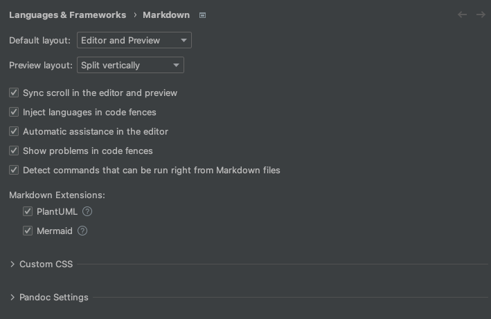
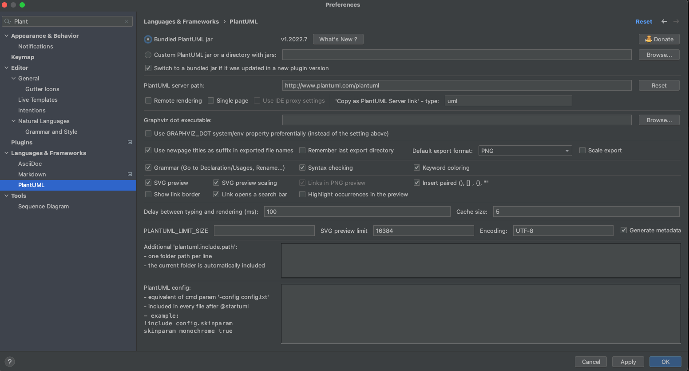

# Setup

## IntelliJ Plugins

- Markdown is already bundled -- make sure to enabled it
- [Plant UML Parser](https://plugins.jetbrains.com/plugin/15524-plantuml-parser)
- [Plant UML Integration](https://plugins.jetbrains.com/plugin/7017-plantuml-integration)

## Configuration

### Markdown Configuration

### Plant UML Configuration

## Links

- [Bitbucket Markdown](https://bitbucket.org/tutorials/markdowndemo/src/master/#markdown-header-links)
- [Markdown](https://daringfireball.net/projects/markdown/)
- [PlantUML](https://plantuml.com/de/)
