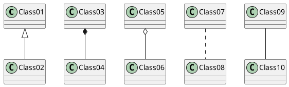
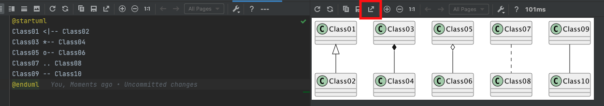

# This is PUML

Use this syntaxt to generate Puml-Diagrams inline
(is not rendered by Bitbucket-Cloud tho)

But one can take a screenshot with the Pumel-Tool in IntelliJ IDEA
and store it inside the images section!

