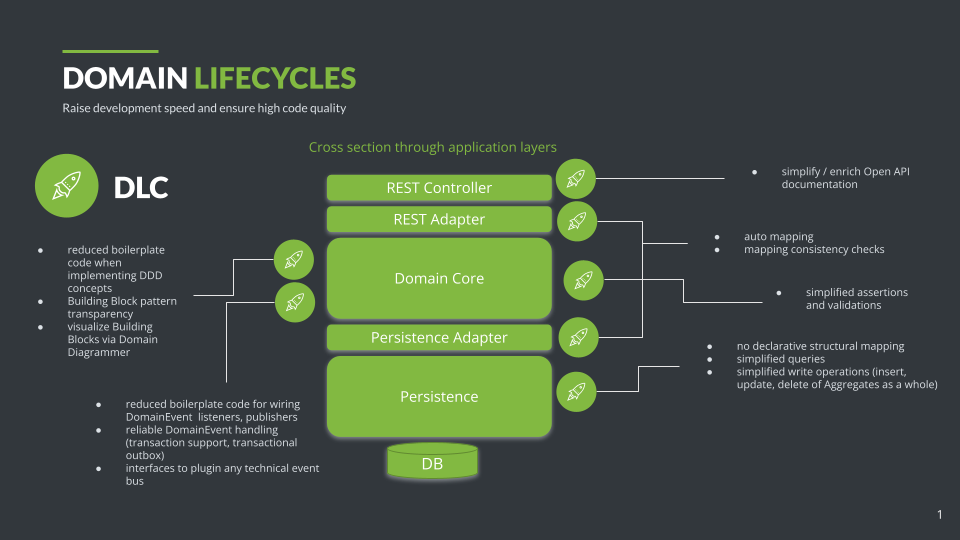

# Domain Lifecycles (DLC)

Domain Lifecycles is a Java based framework for developing business applications following the principles of
`Domain Driven Design` (DDD). The goal is to simplify and accelerate a Java
based [tactical design](https://thedomaindrivendesign.io/what-is-tactical-design/),
so that developers can focus on modelling the domain in an appropriate way without being restricted, constrained
or accidentally being influenced by other pure technical frameworks.

DLC provides features to reduce boilerplate code, especially in adapters implementations to the technical
infrastructure.
Another idea is to make tactical patterns transparent within the code using marker interfaces.
Finally, DLC supports all kinds of domain isolating architecture styles, which
enforce a clean separation of technical from domain concerns, in order to provide better long term quality
characteristics regarding
adaptability, expandability and maintainability as well as a consistently high development.
([Ports & Adapters](https://alistair.cockburn.us/hexagonal-architecture/),
[Onion Architecture](https://medium.com/the-software-architecture-chronicles/onion-architecture-79529d127f85),
[Clean Architecture](https://blog.cleancoder.com/uncle-bob/2012/08/13/the-clean-architecture.html)
).



DLC should enable developers to focus on the domain model and the true added value of the solution (the business value)
instead of "getting lost" in pure technical concerns. Despite the quick implementation of typical default structures,
the developer
should always be able to customize any part of the solution, if needed (e.g. custom mappers, custom naming
conventions,...).

## Features

DLC provides following core features:

- [`Domain Types`](./readme_building_blocks.md)): Implementation of DDD building blocks using DLC interfaces or base
  classes
    * Mark DDD building blocks in the Java code: Make your tactical design more transparent
    * Base for Java typesystem backed meta-data (see below Domain Mirror)

- [`Domain Mirror`](./readme_mirror.md): Mirrors the metamodel of the tactical design structures within bounded contexts
    * Provides structural queries and navigation through a bounded contexts structural metamodel as well as simplified
      reflective access
      on values of instances of a domain's `Aggregates`, `Entities`
      and `ValueObjects`

- [`DomainObject Builders`](./readme_builder_pattern.md): Builder pattern support
    * Complements the DDD Factory pattern
    * Optional: Lombok Builder compatibility

- [`JSON Mapping`](./readme_json_mapping.md): [Jackson](https://github.com/FasterXML/jackson) based JSON mapping
    * Auto mapping DDD building blocks form JSON to Java and vice versa
    * Spring compatible
    * MappingCustomizer API to customize mapping logic
    * Optional: DB Sequence based ID provisioning within a JSON Mapper

- [`Open API Extension`](./readme_open_api.md): API documentation DDD
  building blocks based on [Spring Doc Open API](https://springdoc.org/)
    * API documentation consistently to DLCs Jackson AutoMapping features (out-of-the-box)
    * Spring compatible
    * Adds Bean Validation information in API documentation (together with DLC Bean Validation Support)

- [`Persistence`](./readme_persistence.md): Simplify object relational mapping for persisted DomainObjects
    * Type-safe queries based on jOOQ
    * Supporting and abstracting many common relational database dialects (via jOOQ)
    * Simplified Aggregate queries (DLC Fetcher)
    * Simplified Aggregate CRUD support (DLC Repositories)
    * Object relational auto mapping
    * Persistence Action Event hooks
    * Full ValueObject support regarding persistence
    * Supports `final` Keywords and Java-Optionals within persisted structures

- [`Domain Events`](./readme_domain_events.md): Simplifies some technical concerns about publishing and listening to
  DomainEvents
    * Reduce publisher boilerplate code using the static `DomainEvents.publish()` API
    * Reduce listener and event routing boilerplate code by using the `@ListensTo` annotation
    * Optional: Specific support for Spring or JTA based transaction handling
    * Optional: Support of the "transactional outbox" pattern for more reliable publishing of DomainEvents

- [`Validation`](./readme_validation.md): Simplifies the implementation of business rules and domain specific invariants
    * DomainAssertion API
    * Optional: Extended Support for Java Bean Validation Annotations within DomainObjects to define
      invariants or method pre- and post-Conditions.
    * Optional: ByteCode extension to simplify the implementation of an
      “Always-Valid-Strategy”

- `Spring Web Integration`:
    * Spring Web Integration to enable
      Identities and “single-valued” ValueObjects being directly used as path or query
      parameters

- [`Domain Diagrammer`](./readme_diagrammer.md): Generate text based class diagram for DDD building blocks
    * based on [Nomnoml](https://nomnoml.com/)

## Getting started
You can find our "Getting Started Guide" [here](./getting-started/english/index_en.md)

## DLC Project Setup

### DLC dependencies

DLC provides several JARs which enable the DLC features independently
(they correspond to according sub modules):

| Feature                                                             | Relevant for           | Dependency (groupid:artifactid)              |
|---------------------------------------------------------------------|------------------------|----------------------------------------------|
| Basic domain type interfaces                                        | application developers | io.domainlifecycles:types                    |
| Domain assertions, to express domain specific rules and invariants  | application developers | io.domainlifecycles:assertions               |                         
| Abstract base domain types and utilities                            | application developers | io.domainlifecycles:type-utils               |                       
| Domain type builders                                                | only internally used   | io.domainlifecycles:builder                  |
| General reflection utilities                                        | only internally used   | io.domainlifecycles:reflect                  |
| Interfaces and implementation to access object and class structures | only internally used   | io.domainlifecycles:access                   |
| Domain mirror                                                       | only internally used   | io.domainlifecycles:mirror                   |
| Domain event support                                                | application developers | io.domainlifecycles:domain-events            |  
| Jackson based JSON mapping                                          | application developers | io.domainlifecycles:jackson-integration      |                         
| Service registry                                                    | only internally used   | io.domainlifecycles:service-registry         |
| Persistence interfaces and general persistence management           | only internally used   | io.domainlifecycles:persistence              | 
| jOOQ based implementation for persistence management                | application developers | io.domainlifecycles:jooq-integration         |
| Bean Validation support (javax or jakarta)                          | application developers | io.domainlifecycles:bean-validations         |
| Byte Buddy based auto validation extension                          | application developers | io.domainlifecycles:validation-extender      |
| Spring Doc open API support (Spring Boot 2 compatible)              | application developers | io.domainlifecycles:spring-doc-integration   | 
| Spring Doc 2 open API support (Spring Boot 3 compatible)            | application developers | io.domainlifecycles:spring-doc-2-integration | 
| General Swagger / Open API v3 support                               | only internally used   | io.domainlifecycles:swagger-v3-integration   | 
| Spring Web support (Spring Boot 2 compatible)                       | application developers | io.domainlifecycles:spring-web-integration   | 
| Spring Web support (Spring Boot 3 compatible)                       | application developers | io.domainlifecycles:spring-web-6-integration |
| Nomnoml based domain diagrams                                       | application developers | io.domainlifecycles:domain-diagrammer        | 

To simplify the dependency management using all features in a Spring Boot app using jOOQ for the relational
database persistence management, we provide JARs for a Spring Boot 2 or Spring Boot 3 setup by adding just a single
dependency:

| Application setup                                 | Dependency                                      | 
|---------------------------------------------------|-------------------------------------------------|
| Spring Boot 2 app with all DLC features available | io.domainlifecycles:spring-boot-2-jooq-complete |
| Spring Boot 3 app with all DLC features available | io.domainlifecycles:spring-boot-3-jooq-complete |

Gradle setup for a Spring Boot 3 app:

```Groovy
dependencies{
    implementation 'io.domainlifecycles:spring-boot-3-jooq-complete:2.3.0'
}
```

Maven setup for a Spring Boot 3 app:

```XML
<dependency>
    <groupId>io.domainlifecycles</groupId>
    <artifactId>spring-boot-3-jooq-complete</artifactId>
    <version>2.3.0</version>
</dependency>
```

These single dependencies make the target application build mechanism (Maven or Gradle) providing (downloading) the
required DLC modules and external dependencies
for the target applications classpath.

For detailed information on the setup, have a look at the sample project mentioned below.

### Additional runtime dependencies

Depending on the features used, additionally to the DLC dependencies other runtime libraries must be provided in the
target applications classpath.
Here's an overview of the most important external dependencies:

| Feature                                                               | External dependency                                                                            | Supported versions      |
|-----------------------------------------------------------------------|------------------------------------------------------------------------------------------------|-------------------------|
| Optional Object Builders Lombok Support                               | org.projectlombok:lombok                                                                       | tested with 1.18.30     |     
| Optional fine grained type resolving in the DLC mirror                | com.github.vladislavsevruk:type-resolver                                                       | tested with 1.0.3       |
| Runtime class loading in the DLC mirror and DLC persistence           | io.github.classgraph:classgraph                                                                | tested with 4.8.163     |
| Validation - Javax Bean Validation 2.0 Support                        | (Bean Validation Provider implementation) e.g.: org.hibernate.validator:hibernate-validator    | tested with 6.2.3.Final |
| Validation - Jakarta Bean Validation 3.0 Support                      | (Bean Validation Provider implementation) e.g.: org.hibernate.validator:hibernate-validator    | tested with 8.0.1.Final |
| Validation extension vi Byte Buddy                                    | net.bytebuddy:byte-buddy                                                                       | tested with 1.15.10     |
| Persistence                                                           | org.jooq:jooq                                                                                  | tested with 3.19.6      |
| JSON Mapping                                                          | com.fasterxml.jackson.core:jackson-core <b>and</b> com.fasterxml.jackson.core:jackson-databind | tested with 2.17.2      |
| Open API Support (Spring Doc 1)                                       | org.springdoc:springdoc-openapi-data-rest <b>and</b> org.springdoc:springdoc-openapi-ui        | tested with 1.8.0       |
| Open API Support (Spring Doc 2)                                       | org.springdoc:springdoc-openapi-starter-webmvc-ui                                              | tested with 2.6.0       |
| Spring Converter Support (needed for Spring-Web, Spring Boot 2)       | org.springframework:spring-core                                                                | tested with 5.3.33      |
| Spring Converter Support (needed for Spring-Web, Spring Boot 3)       | org.springframework:spring-core                                                                | tested with 6.1.13      |
| Domain Events, Spring based Transactional Outbox (Spring Boot 3 only) | org.springframework:spring-jdbc                                                                | tested with 6.1.13      |
| Domain Events, Spring based Transaction Support (Spring Boot 3 only)  | org.springframework:spring-tx                                                                  | tested with 6.1.13      |
| Domain Events, Jakarta JTA Support                                    | (JTA Provider implementation) e.g.: Atomikos com.atomikos:transactions-jta                     | tested with 6.0.0       |
| Domain Events Gruelbox Transactional Outbox                           | com.gruelbox:transactionoutbox-core                                                            | tested with 6.0.553     |
| Domain Events ActiveMq Classic                                        | org.apache.activemq:activemq-client                                                            | tested with 5.18.4      |
| Logging                                                               | (SLF4J Provider) e.g.: ch.qos.logback:logback-classic                                          | tested with 1.5.3       |           

Run `./gradle dependencies` on the main project or any of the submodules to get a complete overview of the dependencies
that must be provided on the target applications runtime classpath.

Newer or even older versions which are not tested might still work! Just try it.

DLC logging is based on SLF4J.
Remember to provide a SLF4J-Provider in your classpath.

### Sample projects

A Gradle based sample project that demonstrates all DLC features can be found [here](./sample-project)

