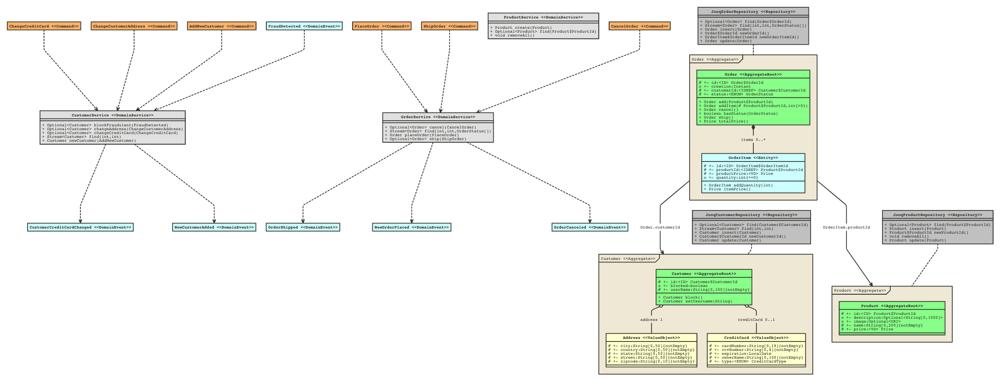

# NitroX Domain Lifecycles Diagrammer (EXPERIMENTAL)

The NitroX DLC Diagrammer currently generates [Nomnoml](https://nomnoml.com/) diagram texts.
Nomnoml is tool for drawing UML diagrams based on a simple syntax. 

The generated diagram text currently describes UML class diagram, which sets the focus on the used DDD patterns.
Most of the meta-information needed is derived from the used Nitrox DLC marker interfaces for the DDD [Building Blocks](./readme_building_blocks.md). 

Have a look at our [sample project](./dlc-sample), and diagram text generated [here](./dlc-domain-diagrammer/src/test/java/nomnoml/generator/NomnomlDomainDiagramGeneratorTest.java) 
by executing the test `generateSampleApp()` to the standard output. 

There are several options to adjust the diagram settings, have a look at `nitrox.dlc.diagram.domain.config.DomainDiagramConfig`.

## Example how to use it

1. Add `nitrox:dlc-domain diagrammer` dependency to your project (in your test setup) 
2. Add a test like the following
```Java
class NomnomlDomainDiagramGeneratorTest {
    
    @Test
    void generateSampleApp() throws Exception {
        Domain.initialize(new ReflectiveDomainMirrorFactory("sampleshop"));
        DomainDiagramConfig diagramConfig = DomainDiagramConfig.builder().withContextPackageName("sampleshop").build();
        DomainDiagramGenerator generator = new DomainDiagramGenerator(
                diagramConfig);
        
        String actualDiagramText = generator.generateDiagramText();
        File file = new File("generated_nomnoml_example.nomnoml");
        FileUtils.writeStringToFile(file, actualDiagramText, StandardCharsets.UTF_8);
    }
} 
```
3. After running the test you can copy the generated output from `generated_nomnoml_example.nomnoml` into [`https://nomnoml.com/`](https://nomnoml.com/) to view and even edit the diagram.
    - You can also save images from there
    - On Nomnoml projects page, you can find information on how to generate images directly or to host your own Nomnoml drawer instance via Docker.



## Rendering from commandline to image

First install `nomnom-cli` via `npm`.
- $ npm install nomnoml-cli -g

Then render any nomnoml file into an image.
- $ cat graph.nomnoml | nomnoml > graph.png

More on the usage of `nomnoml-cli`: https://github.com/prantlf/nomnoml-cli
