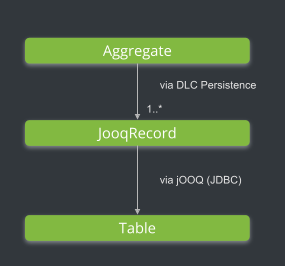
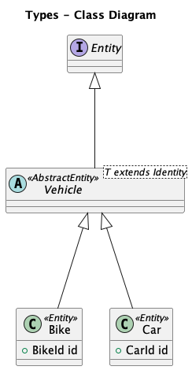
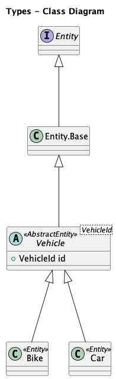

## Domain Lifecycles Persistence

DLC Persistence is all about object relational mapping and Aggregate persistence via Repositories.
The DDD recommendation is to implement the persistence related access on Aggregates within a Repository.
Each Aggregate and each of the contained Entities or ValueObjects need to be mapped to corresponding
tables or columns in the course of the object relational mapping.

The current DLC Persistence implementation is technically based on [jOOQ](https://www.jooq.org/)).
jOOQ provides Java Wrappers for relational Database Objects (e.g. tables, sequences,...).
That enables a simple 1-1 mapping between tables and jOOQ records (don't mix up jOOQ records with Java records).

With DDD in mind, we want to abstract from these rather technical representations.
Repositories should provide interfaces to query complete Aggregates or to pass complete
Aggregates to be inserted, updated or deleted. Ideally a repository provides the illusion
of an in‐memory collection of all objects of that Aggregate’s root type. DLC persistence provides means to achieve
exactly that behaviour with less effort.
It helps to overcome the natural impedance mismatches that exist between the Aggregates technical representations.



An Aggregate typically is composed of several different Entities and ValueObjects in form of a hierarchical object tree.
These objects have to mapped into jOOQ records which then are mapped into their table representations via jOOQ.
The mapping must be consistent in each direction either when reading from or writing to the underlying datastore.

DLC Persistence provides:

- [Automatic mapping of Aggregates from/into jOOQ records](#automapping)
- [RecordMappers](#recordmapper) to customize that mapping if needed
- [Fetchers](#fetcher) to simplify read operations and read mapping on Aggregates
- [Base Repository implementations](#dlc-repositories) to simplify write operations on Aggregates

In most cases it is sufficient just to extend `io.domainlifecycles.jooq.imp.JooqAggregateRepository` for an adequate DDD
style
repository implementation, without needing to implement additional mapper classes or the need to declare object
relational mapping behaviour in detail.
Have a look at the repositories within our [sample project](./dlc-sample), to see how DLC persistence works.

Here is an overview of more details about DLC Persistence and some additional features:

- [jOOQ](#jooq)
    - [jOOQ build configuration for DLC](#jooq-build-configuration)
        - [Maven](#maven-setup")
        - [Gradle](#gradle-setup)
        - [Flyway](#flyway-setup)
    - [jOOQ runtime configuration with DLC](#jooq-runtime-configuration)
- [DLC Persistence configuration](#persistence-configuration)
    - [Minimal persistence configuration](#minimal-persistence-configuration)
    - [Extended persistence configuration](#extended-persistence-configuration)
- [DLC Repositories](#dlc-repositories)
    - [Optimistic Locking](#optimistic-locking)
    - [Change Tracking with Persistence Actions](#change-tracking)
    - [Queries via Fetcher](#fetcher)
    - [Object relational mapping](#or-mapping)
        - [AutoMapping](#automapping)
        - [RecordMapper](#recordmapper)
        - [record mapped ValueObjects](#record-mapped-valueobjects)
        - [EntityValueObjectRecordTypeConfiguration](#entityvalueobjectrecordtypeconfiguration)
        - [TypeConverter](#typeconverter)
        - [Working with inheritance](#inheritance)
            - [Inheritance of Entities or AggregateRoots](#inheritance-entities)
                - [Dedicated Tables Inheritance](#dedicated-tables-inheritance)
                - [Single Table Inheritance](#single-table-inheritance)
            - [Inheritance of ValueObjects](#inheritance-of-valueobjects)

<a name="jooq"></a>

### jOOQ

jOOQ provides many functions for accessing relational databases in a type-safe-manner:

- [Type safe SQL queries](https://www.jooq.org/#a=usp-typesafe-sql)
- [Supporting and harmonizing the acces on many different SQL dialects](https://www.jooq.org/#a=usp-standardisation)
- [Code generation](https://www.jooq.org/#a=usp-code-generation)

Jooq simplifies and harmonizes the way Java applications access relational databases.

<a name="jooq-build-configuration"></a>

#### jOOQ Build configuration for DLC

DLC relies on jOOQ generated classes which represent the accessed database objects.
DLC projects can work with either Maven or Gradle. We show how to configure jOOQ
class generation in the build process in the following sections.

<a name="maven-setup"></a>

##### Maven

Maven setup regarding jOOQ:

```XML
<?xml version="1.0" encoding="UTF-8"?>
<project xmlns="http://maven.apache.org/POM/4.0.0" xmlns:xsi="http://www.w3.org/2001/XMLSchema-instance"
         xsi:schemaLocation="http://maven.apache.org/POM/4.0.0 https://maven.apache.org/xsd/maven-4.0.0.xsd">
    ...
    <dependencies>    
      ...
    </dependencies>
    
    <build>
        <plugins>
            ...

            <!-- ======================================================== -->
            <!-- BUILD::PLUGIN::JOOQ                                      -->
            <!-- ======================================================== -->
            <!-- Use org.jooq            for the Open Source Edition
                     org.jooq.pro        for commercial editions,
                     org.jooq.pro-java-8 for commercial editions with Java 8 support,
                     org.jooq.pro-java-6 for commercial editions with Java 6 support,
                     org.jooq.trial      for the free trial edition

                     Note: Only the Open Source Edition is hosted on Maven Central.
                     Import the others manually from your distribution
            -->
            <plugin>
                <groupId>${db.jooq.groupId}</groupId>
                <artifactId>jooq-codegen-maven</artifactId>
                <version>${db.jooq.version}</version>
                <!-- The jOOQ code generation plugin is also executed in
                     the generate-sources phase, prior to compilation.
                -->
                <executions>

                    <!-- ======================================================== -->
                    <!-- ::JOOQ.GENERATE-SOURCES      -->
                    <!-- ======================================================== -->
                    <execution>
                        <id>generate-sources-demo</id>
                        <phase>generate-sources</phase>
                        <goals>
                            <goal>generate</goal>
                        </goals>
                        <configuration>
                            <jdbc>
                                <url>${db.url}</url>
                                <user>${db.username}</user>
                                <password>${db.password}</password>
                            </jdbc>
                            <generator>
                                <generate>
                                    <generatedAnnotation>false</generatedAnnotation>
                                    <generatedAnnotationType>DETECT_FROM_JDK</generatedAnnotationType>
                                    <javaTimeTypes>true</javaTimeTypes>
                                </generate>
                                <database>
                                    <includes>.*</includes>
                                    <schemata>
                                        <schema>
                                            <inputSchema>${inputSchema}</inputSchema>
                                        </schema>
                                    </schemata>
                                    <recordVersionFields>CONCURRENCY_VERSION</recordVersionFields>
                                    <forceIntegerTypesOnZeroScaleDecimals>true</forceIntegerTypesOnZeroScaleDecimals>
                                </database>
                                <target>
                                    <packageName>${targetPackage}</packageName>
                                    <directory>${targetDirectory}</directory>
                                </target>
                            </generator>
                        </configuration>
                    </execution>
                  
                </executions>
            </plugin>
        </plugins>
    </build>

</project>
```

Watch out: DLC requires the use of optimistic locking.
To use the optimistic locking feature in an appropriate way, define:
`<recordVersionFields>CONCURRENCY_VERSION</recordVersionFields>`!

<a name="gradle-setup"></a>

##### Gradle

A similar example for Gradle can be found in our [sample project](./dlc-sample).

<a name="flyway-setup"></a>

#### Flyway

To use be able to use DLC Persistence currently only jOOQ is available as persistence provider.
Therefore, it is necessary to generate jOOQ classes representing the database tables and other database objects.

The build setup of jOOQ in connection with Flyway is our recommended setup. As it's a bit tricky, you can refer to the
sample project linked below,
to see the setup working with Maven as well as with Gradle.

The use of [Flyway](https://flywaydb.org/) is not necessary for DLC, but we nonetheless recommend the use of
a tool for database structure version control.

<a name="jooq-runtime-configuration"></a>

#### jOOQ runtime configuration with DLC

A typical runtime configuration for jOOQ using Spring Boot looks like that:

```Java
@Configuration
public class PersistenceConfiguration {

    @Bean
    public DataSourceConnectionProvider connectionProvider(DataSource dataSource) {
        return new DataSourceConnectionProvider(new TransactionAwareDataSourceProxy(dataSource));
    }

    /**
     * DLC requires optimistic locking in JOOQ Config
     */
    @Bean
    public DefaultConfiguration configuration(DataSource dataSource) {
        final var jooqConfig = new DefaultConfiguration();
        jooqConfig.settings().setExecuteWithOptimisticLocking(true);
        jooqConfig.setConnectionProvider(connectionProvider(dataSource));
        jooqConfig.set(SQLDialect.H2);
        return jooqConfig;
    }

    @Bean
    public DefaultDSLContext dslContext(DataSource dataSource) {
        return new DefaultDSLContext(configuration(dataSource));
    }

}
```

Watch out: Don't forget to set the appropriate SQL dialect!

<a name="persistence-configuration"></a>

### DLC Persistence configuration

<a name="minimal-persistence-configuration"></a>

#### Minimal persistence configuration

A minimal configuration example of a `io.domainlifecycles.persistence.provider.DomainPersistenceProvider`
(`io.domainlifecycles.jooq.imp.provider.JooqDomainPersistenceProvider`) looks as follows :

```Java
@Bean
public JooqDomainPersistenceProvider domainPersistenceProvider(
        DomainObjectBuilderProvider domainObjectBuilderProvider,
        Set<RecordMapper<?, ?, ?>> customRecordMappers
        ) {
          return new JooqDomainPersistenceProvider(
          JooqDomainPersistenceConfiguration.JooqPersistenceConfigurationBuilder
          .newConfig()
          .withDomainObjectBuilderProvider(domainObjectBuilderProvider)
          .withCustomRecordMappers(customRecordMappers)
          .withRecordPackage(JOOQ_RECORD_PKG)
          .make());
        }
        
```

For a minimal setup:

- A DomainObjectBuilderProvider instance is required for DLCs internal automapping functionality.
- We can add a list of custom RecordMappers (optionally).
- Also, the full qualified package name where DLC persistence can expect to find all corresponding jOOQ record classes
  must be defined.

The DomainPersistenceProvider instance must finally be injected into all repository instances.

<a name="extended-persistence-configuration"></a>

#### Extended persistence configuration

DLC persistence provides many more options to customize the persistence behaviour, by implementing and passing instances
of the following interfaces:

- `io.domainlifecycles.persistence.mapping.converter.TypeConverterProvider`: Enables customizing of generic type
  conversions between jOOQ record properties and DomainObject properties, see [TypeConverter](#typeconverter).
- `io.domainlifecycles.persistence.records.EntityValueObjectRecordTypeConfiguration`: Enables customizing of the jOOQ
  record class that should be mapped to a ValueObject class (for example, if DLC naming conventions don't work),
  see [EntityValueObjectRecordTypeConfiguration](#entityvalueobjectrecordtypeconfiguration).
- `io.domainlifecycles.persistence.records.RecordTypeToEntityTypeMatcher`: To adjust matching strategy between Entity
  types to Jooq record types (if DLC naming conventions are not sufficient).
- `io.domainlifecycles.persistence.mapping.RecordPropertyMatcher`: To adjust matching strategy between field mirrors to
  Jooq record properties (if DLC naming conventions are not sufficient).
- `io.domainlifecycles.persistence.records.RecordPropertyAccessor`: To adjust the way values of record properties are
  accessed (by default via reflection).
- `io.domainlifecycles.persistence.mapping.IgnoredFieldProvider`: To define fields of DomainObjects, that should be
  ignored in persistence mapping process.
- `io.domainlifecycles.persistence.mapping.IgnoredRecordPropertyProvider`: To define record properties of jooq records,
  that should be ignored in persistence mapping process.

<a name="dlc-repositories"></a>

### DLC Repositories

In DLC the type signature of a Repository shows for which Aggregate it is responsible.
The AggregateRoot class as well as the AggregateRoots Identity class have to be passed as type parameters:

```Java
public class MyAggregateRepository extends JooqAggregateRepository<MyAggregateRoot, MyAggregateRootId> {
    ...
}
```

DLC Repositories provide by default the following methods:

- Inserting of new Aggregates
  > public A insert(A root)

  By calling `insert(MyAggregateRoot a)` the complete Aggregate will be inserted in the database (throwing unique key
  exceptions, if already inserted)
  DLC takes care of the correct insert order (depending on the defined Foreign Key Constraints).
  The repository emits PersistenceActions for every inserted DomainObject (=each object in the Aggregates object tree).

- Updating existing Aggregates:
  > public A update(A root)

  By calling `update(MyAggregateRoot a)` changes within the Aggregate compared to the currently persisted (by default
  read committed isolation level) state are detected.
  All detected changes are updated in their corresponding table rows (the corresponding SQL DML statements are
  executed).
  The SQL DML operations (`INSERT`, `UPDATE`, `DELETE`) are executed in an order taking care of defined Foreign Key and
  Unique Key Constraints.
  The repository emits PersistenceActions for every change.

- Deleting Aggregates:
  > public Optional&lt;A&gt; deleteById(I id)

  Via `deleteById(Identity id)` the complete Aggregate is deleted.
  The corresponding SQL DELETE statements are performed in an order taking care of defined Foreign Key and
  Unique Key Constraints
  The repository emits PersistenceActions for every deleted DomainObject (=each object in the Aggregates object tree).

- Loading Aggregates by Id:
  > public FetcherResult<A, UpdatableRecord<?>> findResultById(I id)

  > public Optional&lt;A&gt; findById(I id)

  Via `findByResultId(Identity id)` the complete Aggregate is loaded from the database.
  The `FetcherResult` contains the `resultValue` (= the Aggregate as
  Java DomainObject) as well as the `FetcherContext`,
  which allows to access the loaded data in form of jOOQ-`UpdatableRecords`.

- Simplify queries via Fetcher:
  > public Fetcher<A, I> getFetcher()

  The [Fetcher](#fetcher) is the zentral entry point in each repository to simplify
  read operations.

Default Repository example:

```Java
@Component
public class OrderRepository extends JooqAggregateRepository<Order, OrderId> {
    
    private static final Logger log = org.slf4j.LoggerFactory.getLogger(OrderRepository.class);
    private final JooqDomainPersistenceProvider jooqDomainPersistenceProvider;
    
    public OrderRepository(DSLContext dslContext,
                                SpringPersistenceEventPublisher persistenceEventPublisher,
                                JooqDomainPersistenceProvider jooqDomainPersistenceProvider) {
        super(
            Order.class,
            dslContext,
            jooqDomainPersistenceProvider,
            persistenceEventPublisher
        );
        this.jooqDomainPersistenceProvider = jooqDomainPersistenceProvider;
    }
    
}
```

Watch out: You need a jOOQ `DSLContext` instance and provide it to the Repository!

<a name="optimistic-locking"></a>

#### Optimistic Locking

Write operations on Aggregates are protected from concurrent accesses by
[optimistic locking](#optimistic-locking). DLC protects the complete Aggregate, as each write operation
increases the AggregateRoot's `concurrencyVersion`. That way the transactional guarantees of an Aggregate
are always satisfied.

The optimistic locking of DLC is based on
the [optimistic locking feature of jOOQ](https://www.jooq.org/doc/latest/manual/sql-execution/crud-with-updatablerecords/optimistic-locking/).

DLC requires each Entity and each AggregateRoot to define a `concurrencyVersion` property.
The corresponding tables need to provide appropriately mapped `concurrency_version` columns.

The jOOQ configuration must enable optimistic locking. See the following Java/Spring Boot based example:

```Java
    @Bean
    public DefaultConfiguration configuration(DataSource dataSource) {
        DefaultConfiguration jooqConfiguration = new DefaultConfiguration();
        //Optimistic locking is required for DLC Persistence
        jooqConfiguration.settings().setExecuteWithOptimisticLocking(true);
        jooqConfiguration.setConnectionProvider(connectionProvider(dataSource));
        //The jOOQ SQL Dialect is required for DLC Persistence
        jooqConfiguration.set(SQLDialect.H2);
        return jooqConfiguration;
    }
```

<a name="change-tracking"></a>

#### Change Tracking with Persistence Actions

Like already mentioned, emit DLC Repositories PersistenceActions for every
SQL DML operation applied to the tables of a
Domain Object (AggregateRoot, Entity or ValueObject).
These persistence events announce, which DML operation (`INSERT`, `UPDATE` oder `DELETE`) were performed.

This mechanism works for any kind of change tracking logic.
It could be used as a base mechanism for CQRS, extended logging,
auditing or for example to keep an external search index in sync.

Every Repository allows to pass a `io.domainlifecycles.core.persistence.repository.PersistenceEventPublisher`,
that enables to pass the PersistenceActions to any kind of event bus.

The following example shows the constructor of a Repository using a 'customized' EventPublisher:

```Java
    ...
    public MyAggregateRootRepository(
            DSLContext dslContext,
            MyPersistenceEventPublisher persistenceEventPublisher,
            JooqDomainPersistenceProvider jooqDomainPersistenceProvider)
    {
        super(
            MyAggregate.class,
            dslContext,
            jooqDomainPersistenceProvider,
            persistenceEventPublisher
        );
    }
    ...
```

For Spring based projects the Spring internal EventBus is a good match:

```Java
    @Slf4j
    @Component
    public final class SpringPersistenceEventPublisher implements PersistenceEventPublisher {
    
        private final ApplicationEventPublisher applicationEventPublisher;
    
        public SpringPersistenceEventPublisher(ApplicationEventPublisher applicationEventPublisher) {
            this.applicationEventPublisher = applicationEventPublisher;
        }
    
        public void publish(@NonNull PersistenceAction pa ) {
            final PersistenceEvent event = assembleEvent(pa);
            applicationEventPublisher.publishEvent(event);
        }
        
        private PersistenceEvent assembleEvent(final PersistenceAction persistenceAction) {
            ...
            return new PersistenceEvent(persistenceAction);
        }
    }
```

<a name="fetcher"></a>

#### Queries via Fetcher

The 'Fetcher' simplifies the loading of Aggregates. It ensures that always
complete object trees are loaded. It avoids that the developer has to formulate sub-queries
or complex joins to access all tables of the aggregate.

ATTENTION: An important prerequisite for the correct functioning of the
fetcher is that all Foreign Key constraints are defined on database level. The fetcher uses the
Foreign Key relationships internally to load Entities and ValueObjects on deeper nesting levels.

An example of a load operation via Fetcher would be the typical `findAll()`
-case:

```Java
  ...
    public Stream<Order> findAllOrders() {
        List<Order> result = dslContext.select()
        .from(ORDER)
        .fetch().stream()
        .map(r -> getFetcher().fetchDeep(r.into(ORDER)).resultValue().get()).collect(Collectors.toList());
        return result;
    }
 ...
```

The AggregateRoot named `Order` is represented on database level by the
table `ORDER`.
In the shown example all `Orders` are selected by a jOOQ typed query. In the result stream
then `getFetcher().fetchDeep()` loads the complete aggregate for each `ORDER` `Record`.
The fetcher loads all associated tables (such as `ORDER_POSITION`) and
maps the results appropriately, into the respective
DDD compliant object structures of the Aggregate `Order`.

A more complex example with pagination:

```Java
    public List<Order> findOrdersPaged(int offset, int pageSize) {
        List<Order> result = dslContext.select()
            .from(Order)
            .orderBy(ORDER.ID)
            .offset(offset)
            .limit(pageSize)
            .fetch().stream()
            .map(r -> getFetcher().fetchDeep(r.into(ORDER)).resultValue().get()).collect(Collectors.toList());
        return result;
    }
```

Another complex example with pagination and additional filter:

```Java
    public List<Order> findOrdersPagedHavingStatusCode(OrderStatusCode statusCode, int offset, int pageSize) {
        List<Order> result = dslContext.select()
            .from(ORDER)
            .where(ORDER.STATUS_CODE.eq(statusCode.name())) 
            .orderBy(ORDER.ID)
            .offset(offset)
            .limit(pageSize)
            .fetch().stream()
            .map(r -> getFetcher().fetchDeep(r.into(ORDER)).resultValue().get()).collect(Collectors.toList());
        return result;
    }
```

The Fetcher loads the complete Aggregate given an Aggregate-Id or given an AggregateRoot-Record.
Corresponding `SELECT`-statements for subordinate Entities and possibly ValueObjects are performed
via `getFetcher.fetchDeep()`.
This is not necessarily always the optimal way regarding performance behavior.
In most cases, however, the performance is sufficient, in other
cases `io.domainlifecycles.core.persistence.fetcher.RecordProvider` can be used to retrieve database records using
optimized `SELECT` statements defined by the programmer.
The Fetcher will then only execute `SELECTs` to load records for missing DomainObject types not passed to the
RecordProvider.
In any case it maps the passed or additionally fetched `Records` into the appropriate object structure composes them
into the resulting object tree.

ATTENTION: When using a RecordProvider, it is recommended, that a new Fetcher is created for each query execution,
where the record provider is involved. The RecordProviders must provide the records for each single request based on the
current query conditions.
To make sure that, the fetcher instance used, uses the correctly provided records, it's more safe to create a new
fetcher instance for each request.

The more complex, but in the sense of fewer `SELECT` statements
optimized alternative, is demonstrated here:

```Java
    public Stream<Order> findOrdersOptimized(int offset, int pageSize) {
        // we define a new fetcher to fetch complete Order aggregates
        var fetcher = new JooqAggregateFetcher<Order, OrderId>(Order.class, dslContext, jooqDomainPersistenceProvider);

        io.domainlifecycles.test.tables.Order o = ORDER.as("o");

        //we fetch the records for Orders and OrderPositions for the paged resultset in one query
        var joinedRecordsSelect = dslContext.select()
                .from(
                    dslContext.select()
                    .from(ORDER)
                    .orderBy(ORDER.ID)
                    .offset(offset)
                    .limit(pageSize)
                        .asTable("o")
                )
              .leftJoin(ORDER_POSITION)
              .on(o.ID.eq(ORDER_POSITION.ORDER_ID)));

        var records = dslContext.fetch(joinedRecordsSelect);
        
        //now split Order records and OrderPosition records in two distinct sets
        var orderRecords = records.into(ORDER).stream().filter(r -> r.getId()!=null).collect(Collectors.toSet());
        var orderPositionRecords = records.into(ORDER_POSITION).stream().filter(r -> r.getId()!=null).collect(Collectors.toSet());

        //here we assign a record provider that delivers the order positions which belong to a given parent order record 
        fetcher.withRecordProvider(
            new RecordProvider<OrderPositionRecord, OrderRecord>() {
                @Override
                public Collection<OrderPositionRecord> provideCollection(OrderRecord parentRecord) {
                    //from all order positions we return the ones which belong to the given parent Order (parentRecord)
                    return orderPositionRecords
                        .stream()
                        .filter(p -> p.getOrderId().equals(parentRecord.getId()))
                        .collect(Collectors.toList());
                }
            },
            Order.class, //this is the containing entity type for which the record provider provides child records 
            OrderPosition.class, // this is the domain object type in which the child record should be mapped
            List.of("orderPositions")); // "orderPositions" is the property name under which the positions should be added to the containing order
        // the record provider delivers prefetched records into the process of the fetcher that still provides the functionality of mapping those records into domain objects 
        // and composing them into valid, complete aggregates 
    
        //with a regular fetcher the following statement would issue multiple SELECTs to fetch ORDER_POSITION records for each ORDER.
        // But as we provided all ORDER_POSITION records with the attached record provider, the statement only maps the records into 
        // their corresponding types (Order or OrderPosition) and composes them into Order aggregates, which are finally returned. 
        var orders = orderRecords.stream().map(br->fetcher.fetchDeep(br).resultValue().get());

        return orders;
    }
```

<a name="or-mapping"></a>

#### Object relational mapping

Part of the object-relational mapping in DLC Persistence is done by jOOQ
(see [jOOQ](#jooq)), especially at the level of mapping between columns and properties.
The jOOQ mapping functionality, which is based on JDBC and unifies SQL dialect
specific features. It is further extended by DLC Persistence,
which automatically derives a mapping, that maps the object tree of an Aggregate from/into a set of table rows.

This mapping takes place in a nearly transparent way for the developer (AutoMapping).

<a name="automapping"></a>

##### AutoMapping

DLC AutoMapping uses naming and structure conventions to map table structures
to DLC object structures. Complex DDD objects can thus be mapped to
complex table structures without writing any mapping boilerplate code (neither the mapping needs to be explicitly
declared).

The following conventions must be followed:

<b>structural conventions:</b>

- Each Entity must correspond to exactly 1 Entity table.
- The `parent_id` Column of an Entity table must be `NOT NULL`.
- Each ValueObject which is in 1:1 relation to its containing Entity will be
  embedded in the Entity table with respect to its relational mapping.
- Each ValueObject, which is in 1:n relation to its containing Entity
  is relationally mapped in an own table. These ValueObjects are called
  called 'record mapped' ValueObjects.
- Each non-static field of an Entity or ValueObject is mapped to a column of the target table.
- Only fields are mapped by AutoMapping, properties represented by getters
  and/or setters should be mapped to records(table structures), then a custom mapper implementation is needed.

<b>data type conventions:</b>

- A [jOOQ natural type mapping of the data types](https://www.jooq.org/doc/latest/manual/)
  between column and property must be possible.
  If a mapping is not possible by jOOQ default behavior, a [TypeConverter](#typeconverter) can be registered,
  which maps the desired Java data type to a jOOQ/JDBC compatible data type.

The following overview represents possible mappings
regarding data types:

| Java type                  | SQL type (Oracle)              | SQL type (Postgres)            |
|----------------------------|--------------------------------|--------------------------------|
| `char`                     | CHAR(1)                        | CHAR(1)                        |
| `java.lang.Character`      | CHAR(1)                        | CHAR(1)                        |
| `boolean`                  | NUMBER(1,0) DEFAULT 0 NOT NULL | BOOLEAN                        |
| `java.lang.Boolean`        | NUMBER(1,0) DEFAULT 0          | BOOLEAN DEFAULT FALSE          |
| `byte`                     | NUMBER(3)                      | SMALLINT                       |
| `java.lang.Byte`           | NUMBER(3)                      | SMALLINT                       |
| `short`                    | NUMBER(5)                      | SMALLINT                       |
| `java.lang.Short`          | NUMBER(5)                      | SMALLINT                       |
| `int`                      | NUMBER(10,0)                   | INT                            |
| `java.lang.Integer`        | NUMBER(10,0)                   | INT                            |
| `long`                     | NUMBER(18)                     | BIGINT                         |
| `java.lang.Long`           | NUMBER(18)                     | BIGINT                         |
| `float`                    | NUMBER(19,6)                   | REAL                           |
| `java.lang.Float`          | NUMBER(19,6)                   | REAL                           |
| `double`                   | NUMBER(19,6)                   | DOUBLE PRECISION               |
| `java.lang.Double`         | NUMBER(19,6)                   | DOUBLE PRECISION               |
| `java.math.BigDecimal`     | NUMBER(19,6)                   | NUMERIC(19,6)                  |
| `java.math.BigInteger`     | NUMBER(18)                     | BIGINT                         |
| `java.time.LocalDate`      | DATE                           | DATE                           |
| `java.time.LocalTime`      | TIMESTAMP(6) WITHOUT TIME ZONE | TIME WITHOUT TIMEZONE          |
| `java.time.LocalDateTime`  | TIMESTAMP(6) WITHOUT TIME ZONE | TIMESTAMP(6) WITHOUT TIME ZONE |
| `java.time.Instant`        | TIMESTAMP(6) WITH TIME ZONE    | TIMESTAMP(6) WITH TIME ZONE    |
| `java.util.Date`           | TIMESTAMP(6) WITH TIME ZONE    | TIMESTAMP(6) WITH TIME ZONE    |
| `java.util.Calendar`       | TIMESTAMP(6) WITH TIME ZONE    | TIMESTAMP(6) WITH TIME ZONE    |
| `java.time.ZonedDateTime`  | TIMESTAMP(6) WITH TIME ZONE    | TIMESTAMP(6) WITH TIME ZONE    |
| `java.time.OffsetDateTime` | TIMESTAMP(6) WITH TIME ZONE    | TIMESTAMP(6) WITH TIME ZONE    |
| `java.time.OffsetTime`     | TIMESTAMP(6) WITH TIME ZONE    | TIME WIT TIME ZONE             |
| `java.time.Year`           | NUMBER(4)                      | NUMERIC(4)                     |
| `java.time.MonthDay`       | NUMBER(4)                      | NUMERIC(4)                     |
| `java.time.YearMonth`      | NUMBER(6)                      | NUMERIC(6)                     |
| `java.lang.String`         | VARCHAR2(n)                    | VARCHAR(n)                     |
| `java.util.UUID`           | CHAR(36)                       | CHAR(36)                       |
| Java Enum                  | VARCHAR2(50)                   | VARCHAR(50)                    |

<b>naming conventions:</b>

- Java class names should be named in the Java typical 'Upper Camel Case' = 'Pascal Case'.
- Java properties of DomainObjects should be named in the Java typical 'Lower Camel Case'.
- Database tables and their columns are to be defined in the so-called Snake Case.
- The names are mapped to each other according to the 'natural' mapping of the respective notations:
    - Java class: orderPosition <==> table: ORDER_POSITION
    - Java property: unitPriceNet <==> column: UNIT_PRICE_NET
- 'record mapped' ValueObjects have a special table naming convention,
  because ValueObjects in general are not fixed to be used in exactly one Entity.
  Example: The table `Order` contains a
  property `List<ActionCode> actionsCodes` where `ActionCode` is a ValueObject: the corresponding table name
  for `ActionCodes` is then
  `ORDER_ACTION_CODES` (the prefix of the containing entity and then the
  PropertyName (Attention: Not the type name, because only property names are always unique))
  If the naming convention for 'record mapped' ValueObjects is unfavorable,
  then an alternative table name can be defined by configuration
  [EntityValueObjectRecordTypeConfiguration](#entityvalueobjectrecordtypeconfiguration)

In the [Sample App](./dlc-sample) you can view a fully AutoMapping capable complex example.

If the conventions for property-level auto-mapping are not followed, DLC will issue an error message when the
application is started and terminates.
In this case it is possible define a RecordMapper to intervene.

<a name="recordmapper"></a>

##### RecordMapper

RecordMappers map tables to class structures as mentioned before.
They are part of the object-relational mapping of DLC Persistence.
DLC Persistence uses RecordMappers internally.
As a rule RecordMappers are never called directly by the application developer.
However, they must be registered as part of the DLC configuration (see below).

Custom RecordMappers must implement `io.domainlifecycles.persistence.mapping.RecordMapper` or
extend `io.domainlifecycles.persistence.mapping.AbstractRecordMapper`.

It must be taken care that all table columns
in the mapping methods are mapped to the properties of the respective class!

The following example illustrates this.
The table `test_entity_one_to_many` has the following structure:

```SQL
CREATE TABLE test_domain.test_entity_one_to_many (
    id NUMBER(18) PRIMARY KEY,
    concurrency_version NUMBER(18) NOT NULL,
    test_root_id NUMBER(18) NOT NULL,
    name VARCHAR2(200),
    FOREIGN KEY (test_root_id) REFERENCES test_domain.test_root_one_to_many(id)
);
```

With the following RecordMapper this table is mapped in both directions into the
entity `TestEntityOneToMany`:

```Java
public class TestOneToManyJooqRecordMapper extends AbstractRecordMapper<TestEntityOneToManyRecord, TestEntityOneToMany, TestRootOneToMany> {

    private final DomainMirror domainMirror;

    public TestOneToManyJooqRecordMapper(DomainMirror domainMirror) {
        this.domainMirror = domainMirror;
    }

    @Override
    public DomainObjectBuilder<TestEntityOneToMany> recordToDomainObjectBuilder(TestEntityOneToManyRecord record) {
        if (record == null) {
            return null;
        }
        TestEntityOneToManyRecord testEntityOneToManyRecord = record.into(Tables.TEST_ENTITY_ONE_TO_MANY);
        return new InnerClassDomainObjectBuilder<TestEntityOneToMany>(TestEntityOneToMany.builder()
            .setId(new TestEntityOneToManyId(testEntityOneToManyRecord.getId()))
            .setName(testEntityOneToManyRecord.getName())
            .setTestRootId(testEntityOneToManyRecord.getTestRootId() == null ?
                null : new TestRootOneToManyId(testEntityOneToManyRecord.getTestRootId()))
            .setConcurrencyVersion(testEntityOneToManyRecord.getConcurrencyVersion()), domainMirror);
    }

    @Override
    public TestEntityOneToManyRecord from(TestEntityOneToMany testEntityOneToMany, TestRootOneToMany root) {
        TestEntityOneToManyRecord testEntityOneToManyRecord = new TestEntityOneToManyRecord();
        testEntityOneToManyRecord.setId(testEntityOneToMany.getId().value());
        testEntityOneToManyRecord.setName(testEntityOneToMany.getName());
        testEntityOneToManyRecord.setTestRootId(testEntityOneToMany.getTestRootId() == null ?
            null : testEntityOneToMany.getTestRootId().value());
        testEntityOneToManyRecord.setConcurrencyVersion(testEntityOneToMany.concurrencyVersion());
        return testEntityOneToManyRecord;
    }
}

```

Custom RecordMappers must be made known to DLC Persistence by configuration:

 ```Java
    var jooqDomainPersistenceConfiguration = JooqDomainPersistenceConfiguration
        .JooqPersistenceConfigurationBuilder
        .newConfig()
        ...
        .withCustomRecordMappers(customRecordMappers) 
        ...
        .make();
 ```

<a name="record-mapped-valueobjects"></a>

##### record mapped ValueObjects

Each ValueObject, which is in 1:n relation to its containing Entity
is relationally mapped in an own table. These ValueObjects are called
called 'record mapped' ValueObjects. But DLC persistence provides mechanisms to define
explicit ValueObject-to-database-table mappings (see below "EntityValueObjectRecordTypeConfiguration").
'Record mapped' ValueObjects must also fulfill certain requirements in their
relational structures (database definition):

- They must have a technical ID (as `PRIMARY KEY`) which is not represented on the
  Java side
- A `SEQUENCE` is required for the assignment of the ID Values, which conforms to the
  naming convention '&lt;Name of the ValueObject table&gt;_SEQ'.
- A `FOREIGN KEY` definition must be created, which refers to the ID of the
  parent Entity or the containing record mapped ValueObject.

The database-side requirements therefore are exemplary:

```SQL
CREATE TABLE test_domain.action_code (
                                          id NUMBER(18) PRIMARY KEY,
                                          container_id NUMBER(18) NOT NULL,
                                          value VARCHAR2(10) NOT NULL,
                                          FOREIGN KEY (container_id) REFERENCES test_domain.order(id)
);

CREATE SEQUENCE test_domain.action_code_seq  MINVALUE 1000 MAXVALUE 999999999999999999 INCREMENT BY 1 START WITH 1000 CACHE 20;
```

<a name="entityvalueobjectrecordtypeconfiguration"></a>

##### EntityValueObjectRecordTypeConfiguration

'EntityValueObjectRecordTypeConfigurations' have two functions:

- They can be used to map 'embedded' ValueObjects into their own separate table.
- Or to override the default naming conventions for 'record mapped' ValueObjects.

A corresponding configuration must be specified in the persistence configurations:

```Java

    var jooqDomainPersistenceConfiguration = JooqDomainPersistenceConfiguration
        .JooqPersistenceConfigurationBuilder
        .newConfig()
        ...
        .withEntityValueObjectRecordTypeConfiguration(
            new EntityValueObjectRecordTypeConfiguration(
            Order.class,
            ActionCode.class,
            ActionCodeRecord.class,
            //The target table is now called ACTION_CODE 
            // (instead of the ORDER_ACTION_CODES assumed in the AutoMapping), 
            // which is mapped by the ActionCodeRecord class.
            "actionCodes"
            )
        )
        ...
        .make();
        
```

<a name="typeconverter"></a>

##### TypeConverter

TypeConverters' offer the possibility of data type conversions in a general
form,
so that for special frequently used data types (which may not be jOOQ compatible) simple conversion
functions can be added to DLC Persistence:

- TypeConverters must implement `io.domainlifecycles.core.persistence.mapping.converter.TypeConverter`.
- They provide only one conversion direction. If the opposite direction is required, a corresponding additional
  TypeConverter must be created and registered.
- The registration of a new TypeConverter is done via the persistence
  configuration:
  ```Java
  var jooqDomainPersistenceConfiguration = JooqDomainPersistenceConfiguration
  .jooqPersistenceConfigurationBuider
  .newConfig()
  ...
  .withTypeConverterProvider(new MyTypeConverterProvider())
  ...
  ```
- A TypeConverterProvider should be created by
  extending `io.domainlifecycles.persistence.mapping.converter.def.DefaultTypeConverterProvider`
  or implementing the
  interface `io.domainlifecycles.persistence.mapping.converter.TypeConverterProvider`
- DLC Persistence adds several default TypeConverters to support mapping
  between Java data types and jOOQ types (i.e. SQL data types, in the end)
  more flexible without having to interfere with jOOQ/JDBC configurations.
  The following converters are already predefined by DLC.
  The name describes the conversion function:

    - DefaultBigDecimalToDoubleConverter
    - DefaultBigDecimalToFloatConverter
    - DefaultBigIntegerToByteConverter
    - DefaultBigIntegerToIntegerConverter
    - DefaultBigIntegerToLongConverter
    - DefaultBigIntegerToShortConverter
    - DefaultBooleanToByteConverter
    - DefaultByteToBigIntegerConverter
    - DefaultByteToBooleanConverter
    - DefaultByteToLongConverter
    - DefaultCalendarToOffsetDateTimeConverter
    - DefaultDateToOffsetDateTimeUTCConverter
    - DefaultDoubleToBigDecimalConverter
    - DefaultDoubleToFloatConverter
    - DefaultFloatToBigDecimalConverter
    - DefaultFloatToDoubleConverter
    - DefaultInstantToOffsetDateTimeUTCConverter
    - DefaultIntegerToBigIntegerConverter
    - DefaultIntegerToYearConverter
    - DefaultIntegerToYearMonthConverter
    - DefaultIntToLongConverter
    - DefaultLocalDateTimeToLocalTimeConverter
    - DefaultLocalDateTimeToOffsetDateTimeUTCConverter
    - DefaultLocalDateToOffsetDateTimeUTCConverter
    - DefaultLocalTimeToLocalDateTimeConverter
    - DefaultLongToBigIntegerConverter
    - DefaultLongToByteConverter
    - DefaultLongToIntConverter
    - DefaultLongToYearMonthConverter
    - DefaultMonthDayToShortConverter
    - DefaultOffsetDateTimeToCalendarConverter
    - DefaultOffsetDateTimeToDateConverter
    - DefaultOffsetDateTimeToInstantConverter
    - DefaultOffsetDateTimeToLocalDateConverter
    - DefaultOffsetDateTimeToLocalDateTimeConverter
    - DefaultOffsetDateTimeToOffsetTimeConverter
    - DefaultOffsetDateTimeToZonedDateTimeConverter
    - DefaultOffsetTimeToOffsetDateTimeConverter
    - DefaultShortToBigIntegerConverter
    - DefaultShortToMonthDayConverter
    - DefaultShortToYearConverter
    - DefaultStringToURIConverter
    - DefaultURIToStringConverter
    - DefaultYearMonthToIntegerConverter
    - DefaultYearMonthToLongConverter
    - DefaultYearToIntegerConverter
    - DefaultYearToShortConverter
    - DefaultZonedDateTimeToOffsetDateTimeConverter

<a name="inheritance"></a>

##### Working with inheritance

The inheritance hierarchy of AggregateRoots, Entities or ValueObjects has
in DLC only a deeper impact on their persistence mapping.
Otherwise, DomainObjects will be recognized as such in DLC as soon as they have
the corresponding marker interfaces somewhere in their inheritance hierarchy.
That means, whether a concrete DomainObject has several levels of inheritance hierarchies has no effect except for
persistence.

<a name="inheritance-of-entities"></a>

###### Inheritance of Entities or AggregateRoots

Entities with an inheritance hierarchy can be created in DLC in two different ways.

Either each top-level Entity is mapped to its own table (default - dedicated tables inheritance)
or all Entity occurrences are mapped to a common table (single table inheritance).

Currently, there is no support for a joined table approach to entity inheritance structures
as with JPA(see JPA `InheritanceType.JOINED').

<a name="dedicated-tables-inheritance"></a>

###### Dedicated tables inheritance

In this case, each concrete manifestation of an Entity is mapped into a separate associated table.
For this it is necessary that on DomainObject level the superclass defines no concrete identity and that each
inheriting entity defines its own identity (corresponding to the one of the associated database table Primary Key).

In this case it is not necessary to use a dedicated
RecordMapper (`io.domainlifecycles.persistence.mapping.RecordMapper`).
AutoMapping can be applied without any problems.

Class diagram for the "dedicated tables inheritance" case:



<a name="single-table-inheritance"></a>

###### Single table inheritance

Each concrete instance of an Entity is mapped into one single central table.
table.
For this it is necessary that on DomainObject level the superclass defines a
concrete Identity and that each
inheriting entity does not have its own Identity (-> then there is only one associated
database table with primary key).

In addition, a dedicated RecordMapper must be defined, which maps each
Entity to the central table.
In the RecordMapper implementation
specific properties must then be mapped according to the concrete entity type.
Properties/columns that are only used for one of the respective entity
must be 'nullable'.

That could look like this, for example:

```Java
public class VehicleRecordMapper extends AbstractRecordMapper<VehicleRecord, Vehicle, Vehicle> {

    private final DomainMirror domainMirror;

    public VehicleRecordMapper(DomainMirror domainMirror) {
        this.domainMirror = domainMirror;
    }

    @Override
    public DomainObjectBuilder<Vehicle> recordToDomainObjectBuilder(VehicleRecord record) {
        if (record == null) {
            return null;
        }
        VehicleRecord vehicleRecord = record.into(Tables.VEHICLE);
        if(Bike.class.getSimpleName().equals(vehicleRecord.getType())){
            return new InnerClassDomainObjectBuilder(Bike.builder()
                .setId(new VehicleId(vehicleRecord.getId()))
                .setGears(vehicleRecord.getGears().intValue())
                .setLengthCm(vehicleRecord.getLengthCm())
                .setConcurrencyVersion(vehicleRecord.getConcurrencyVersion())
                , domainMirror);
        }
        if(Car.class.getSimpleName().equals(vehicleRecord.getType())){
            return new InnerClassDomainObjectBuilder(Car.builder()
                .setId(new VehicleId(vehicleRecord.getId()))
                .setBrand(Car.Brand.valueOf(vehicleRecord.getBrand()))
                .setLengthCm(vehicleRecord.getLengthCm())
                .setConcurrencyVersion(vehicleRecord.getConcurrencyVersion())
                , domainMirror);
        }
        throw new IllegalStateException("Vehicles are only Cars or Bikes!");

    }

    @Override
    public VehicleRecord from(Vehicle p, Vehicle root) {
        if(p instanceof Bike){
            Bike bike = (Bike)p;
            VehicleRecord record = new VehicleRecord();
            record.setId(bike.getId().value());
            record.setConcurrencyVersion(bike.concurrencyVersion());
            record.setLengthCm(bike.getLengthCm());
            record.setGears(Long.valueOf(bike.getGears()));
            record.setType(Bike.class.getSimpleName());
            return record;
        }
        if(p instanceof Car){
            Car car = (Car)p;
            VehicleRecord record = new VehicleRecord();
            record.setId(car.getId().value());
            record.setConcurrencyVersion(car.concurrencyVersion());
            record.setLengthCm(car.getLengthCm());
            record.setBrand(car.getBrand().name());
            record.setType(Car.class.getSimpleName());
            return record;
        }

        throw new IllegalStateException("Vehicles are only Cars or Bikes!");
    }
}
```

Class diagram for the "single table inheritance" case:



<a name="inheritance-of-valueobjects"></a>

###### Inheritance of ValueObjects

In principle, DLC supports inheritance structures in ValueObjects.
A class is recognized by DLC as a ValueObject as soon as in the
class hierarchy the interface `io.domainlifecycles.domain.types.ValueObject` is implemented.
The inheritance structure of ValueObjects has no influence on the
persistence mapping already described [above](#automapping).
