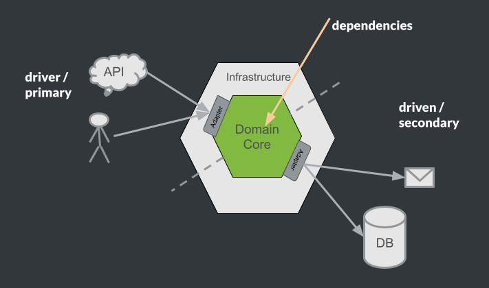

# Sample Application

## Introduction

A simple Spring Boot based online store application implemented with the Domain
Driven Design approach using DomainLifeCycles technology.

This is for demo purposes to show the DDD concepts and technical implementation
in a practical way and to provide a basic understanding of the structure,
architectural concepts and configuration of a DLC-based application.

All DLC features are demonstrated, see [Demonstrated DLC features](#Features).

## Project Layout

+ Given file directory structure

The `sampleshop` uses an H2 database `sampleshop/build/h2-db` and has 2 database
migration scripts `sampleshop/resources/db/migration/V1__ddl_shop_entities.sql`
and `sampleshop/resources/db/migration/V2__dml_shop_entities.sql`
for creating the necessary tables, sequences and their contents. The `build.gradle` file contains
the project's build instructions.

```
    .
    └── sampleshop
        ├── build / h2-db
        │   └── shop.mv.db
        ├── src
        │   └── main
        │       └── java
        │           └── sampleshop
        ├── resources
        │   └── db
        │       └── migration
        │           └── V1__ddl_shop_entities.sql
        │           └── V2__dml_shop_entities.sql
        └── build.gradle    
```

## Build Setup

This demo app is based on [Gradle](./build.gradle).

### Flyway database migration

Flyway is a database migration tool that

+ automates the process of migrating databases.
+ is based on migration scripts which describe database changes to be made to
  the database.
+ Flyway ensures that all stakeholders work with the same version of the
  database schema, avoiding conflicts and errors.
+ Flyway makes it easy to revert changes if something goes wrong during the
  migration process.
+ Flyway can save time and reduce errors when migrating databases to new
  versions or systems.
+ Flyway is compatible with DLC, but not mandatory

### DomainLifeCycles (DLC)

DLC constructs the mechanics for the
control of a proper domain model implementation in Java together with its relational persistence.
This constitutes a technical lifecycle which, in a nutshell, consists of 3 phases:

1. application requests issue loading of domain structures (aggregates) from the
   database loaded into application's memory.
2. application manifests its computational progress by in-memory processing (
   querying and modifying) of the loaded structures ensuring the model's constraints
   and invariant rules are kept at all times.
3. application proceeds by storing the change back to the database and make
   changes observable, emitting persistence or optionally additional domain events.

Apart from that and form a DDD modelling perspective more important, especially Entities and Aggregates have a
lifecycle, which is modelled and expressed by [DDD building block
concepts and other patterns](./../readme_building_blocks.md), which are commonly used by the DDD community.

## Package Structure

``` 
  sampleshop
 
        ├── core
        │   ├── domain
        │   │   ├── customer
        │   │   │   └── Customer AggregateRoot 
        │   │   ├── order
        │   │   │   └── Order AggregateRoot 
        │   │   └── product
        │   │       └── Product AggregateRoot 
        │   ├── inport
        │   │   └── operation specifications (inbound ports --> ports & adapters architecture)
        │   └── outport
        │       └── repository specifications (outbound ports --> ports & adapters architecture)
        ├── inbound (inbound adapters --> ports & adapters architecture)
        │   ├── driver
        │   │   └── driver services (sometimes also called application services)
        │   └── rest
        │       └── API / rest controllers
        └── outbound (outbound adapters --> ports & adapters architecture)
                └── JOOQ and DLC based repository implementations and EmailNotifier outbound service
```

## Ports & Adapters (hexagonal architecture)

Ports & Adapters describes an architecture pattern that is intended for structuring
of long-lived applications. The primary aim is to separate business logic from peripheral logic.
logic. Technical implementation details for network protocols, such as HTTP or REST, or
persistence like JDBC or even concrete database types are hidden from the business logic.

This makes it possible to replace or adjust, for example persistence implementation details at a later date without
affecting the functional business logic.

Ports & Adapters is particularly well suited to be combined with DDD tactical design.
That's why we applied it, in this demo application. You can also view the typical ports and adapters like
separation of technical and domain concerns in the package structure above.



More information on that: [Ports & Adapters by Alistair Cockburn](https://alistair.cockburn.us/hexagonal-architecture/)

## DDD patterns and techniques used in this project

The implementation in this demo application shows, that DLC is very well suited to implement
rich domain model structures instead of an anemic model working as a pure data container.

Invariants of the aggregates, entities and value objects are taken care by assertions and bean validation annotations.
Immutable ValueObjects, typed IDs, references to other aggregates by ID are demonstrated, as well as implementations of
repositories
to access the persistence adapters.

Moreover, we also demonstrate domain services, commands and domain events as additional patterns, which help expressing
business intentions
and interactions within our model.

### Domain Model

This diagram represents a domain model for the `sampleshop` system (and the corresponding bounded context) that deals
with customers, orders,


Here's a breakdown of the different elements in the diagram:

+ `Customer`: This is an aggregate root entity that represents a customer. It
  contains a `CustomerId`, `Address`, and `CreditCard` value objects.
  The `CustomerId` is the unique identifier for each customer, and the `Address`
  and `CreditCard` are value objects that describe the customer's address and credit card information, respectively.

- `Order`: This is another aggregate root entity that represents an order. It
  contains `OrderId`, `OrderItem`s, and `ProductId` attributes. The `OrderId` is the
  unique identifier for each order, and `items` is a list of `OrderItem`
  entities that describe the products that the customer has ordered.
  The `ProductId` is the unique identifier for each product.

+ `Product`: This is an aggregate root entity that represents a product. It
  contains a `ProductId` attribute that uniquely identifies each product.

- `Address` and `CreditCard`: These are value objects that describe a customer's
  address and credit card information. They
  are not entities and do not have a unique identity of their own.

+ `OrderItem`: This is an entity that describes a single item in an order. It
  contains a `productId` attribute that identifies the product being ordered.

Overall, this domain model represents a system that allows customers to place
orders for products.

#### Model interactions

The model interactions are driven by the driver services implemented in
the [driver package](./src/main/java/sampleshop/inbound/driver)

There are several commands used to describe actions with a specific business intention that could be applied
to the aggregates in our application:

Commands for the `Customer` aggregate:

- `AddNewCustomer`: By issuing this command, a new customer will be created.
- `ChangeCreditCard`: Updates the credit card information for an existing customer.
- `ChangeCustomerAddress`: Changes the address information for an existing customer.

Commands for the `Order` aggregate:

- `PlaceOrder`: Places (creates) a new order.
- `CancelOrder`: Cancels an existing order.
- `ShipOrder`: Marks an existing order as shipped.

Please be aware, that we do not follow the exact GOF command pattern in this case.
The commands here just carry the necessary information for the execution and do not contain any execution logic,
because we prefer placing that logic in domain services or even the target aggregates.
But commands are named in a way to reveal their business intention according to the ubiquitous language.

Additionally, there are several domain events published. For most events currently not listener exists, but we could
imagine
other aggregates (for example in other bounded contexts reacting to those events):

Published domain events for the `Customer` aggregate:

- `NewCustomerAdded`: Published after adding a new customer.
- `CustomerCreditCardChanged`: Published after changing credit card information of a customer.

Published domain events for the `Order` aggregate:

- `NewOrderPlaced`: Published after a new order is placed.
- `OrderCanceled`: Published after an order was canceled.
- `OrderShipped`: Published after an order was shipped.

For example a fraud detection mechanism could react to those events by checking the new information.
There is also an incoming domain event which could be demonstrated by the `DemoFraudController`:

- `FraudDetected`: Upon receiving this event, the corresponding customer will be "blocked".

The `Product` aggregate offers no commands or events, just a simple API, which allows adding new products or deleting
all. We
could imagine, that products are managed within another bounded context (maybe in a legacy application) and here we only
have an API
with which a nightly job might be able to "update" the product information (old school way ;-)).

#### ReadModel

The [CustomerService](./src/main/java/sampleshop/inbound/driver/CustomerService.java) delivers a specific ReadModel
[OrdersByCustomer](./src/main/java/sampleshop/core/outport/OrdersByCustomer.java), that is provided by
the implementation of a
QueryHandler [JooqOrdersByCustomerQueryHandler](./src/main/java/sampleshop/outbound/JooqOrdersByCustomerQueryHandler.java).

## Entity-Relationship Model

This is an Entity-Relationship diagram that represents the database structure of the `sampleshop` system:

```
                ┌────────────┐      ┌──────────┐
                │   ORDER    │┼────┼│ CUSTOMER │
                └────────────┘      └──────────┘
                       ┼                        
                      ╱│╲                       
                ┌────────────┐      ┌─────────┐
                │ ORDER_ITEM │┼────┼│ PRODUCT │
                └────────────┘      └─────────┘
```

The diagram shows relationships between the entities:

+ `Customer` and `Order`: The relationship between `Customer` and `Order` is a
  one-to-many relationship because a customer can place multiple orders, but
  each order is placed by only one customer. The relationship indicates that an
  order is associated with one customer.

- `Order_Item` and `Order`: The relationship between `Order_Item` and `Order` is
  a one-to-many relationship because an order can have multiple items, but each
  item belongs to only one order.

+ `Order_Item` and `Product`: The relationship between `Order Item`
  and `Product` is a many-to-one relationship because a product can be ordered
  multiple times, but each order item corresponds to only one product.

The mapping between the tables described
in [V1__ddl_shop_entities.sql](./src/main/resources/db/migration/V1__ddl_shop_entities.sql)
and the corresponding aggregates is completely done by the DLC Persistence automapping features, relying on
the typical structural and naming conventions.

<a name="Features"></a>

## Demonstrated DLC features

Several features of DLC simplify the implementation of an application with common DDD patterns
based on the well known tactical design building blocks:

- DLC provides several base (marker) interfaces and base types, that mark classes as
  `AggregateRoot`, `Entity` or `ValueObject`. The ID of an `Entity` has to be an `Identity` and forms a typed ID.
- Based on these base interfaces DLC provides support for Jackson serialization, which reduces the need to declare
  annotations or custom de-/serializers for domain objects.
- DLC provides persistence support for several types of relational databases (based on JOOQ). It reduces the need
  for writing mapper classes or adding ORM specific annotations to manage persistence behaviour. So the amount
  of boilerplate code in the persistence layer is reduced in a great way. DLC persistence relies therefore
  on the type information of the already mentioned base interfaces and natural naming and structure conventions.
  DLC persistence works well with immutability (Java records and final field modifiers) and has no need for default
  constructors.
  Java Optional fields are also supported.
- Furthermore, DLC provides an integration for Spring (Spring Boot 2 and Spring Boot 3, Spring Boot 3 being demonstrated
  here)
  and Spring Doc Open API to simplify correct API documentation (Open API/Swagger).
- DLC works well with Lombok.
- DLC provides support for DomainAssertions an integration with Jakarta Bean Validation annotations,
  what simplifies the definition of invariants in our domain classes, which are met at any point in their lifecycle (
  always valid domain objects).
- DLC provides support to reduce boilerplate code around DomainEvent handling being demonstrated here. Have a look
  at the [Customer aggregate](./src/main/java/sampleshop/core/domain/customer/Customer.java) to see how Domain Events
  this way
  are represented as "first class citizens" of the aggregates interface.

More details and even more features can be found in our [`documentation`](./../readme.md).

## Important requirements and restrictions

- DLC requires Java 17 or above
- DLC needs constructors that set all(!) fields of a domain object.
  The constructor parameters must be named exactly like the fields.
- DLC relies on inner builders (easily simplified by Lombok builders).

## Run the demo app

- Run the `sampleshop.ShopApplication` with your IDE like any other Spring Boot app
- Or `cd sample-project` and run `./gradlew bootRun` to start the application.
- The Swagger endpoints are available under `http://localhost:8080/swagger-ui.html`
- You can access the database via H2 Web console via `http://localhost:8080/h2-console/`
    - Make sure to use `jdbc:h2:./dlc-sample/build/h2-db/test` as JDBC URL (application should be started, with the
      general DLC repository as root path)
    - Some default test data is already available
- You might also have a look at (or run) the tests to study the demonstrated features

## Diagrams

The DLC plugin is configured to generate domain model diagrams.
Within the sample projects directory, run `./gradlew createDiagram` to generate the diagrams.
You should find generated diagrams as `build/aggregates.svg` and `build/complete.svg`

Docker must be available to generate SVGs. Otherwise you can generate Nomnoml sources and render them 
with [nomnoml.com](https://www.nomnoml.com/) or use [Kroki](https://kroki.io/) 
