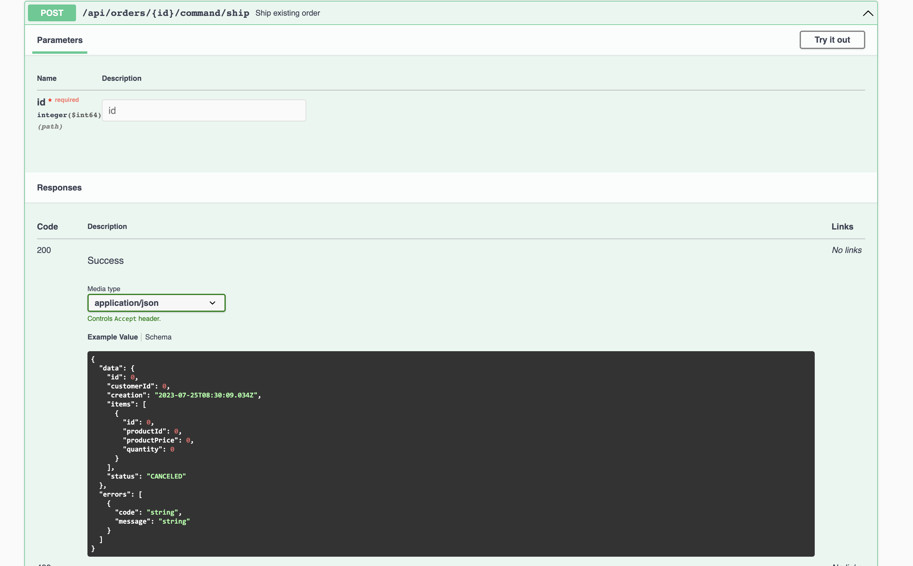

## DomainLifeCycles Open API support (SpringDoc 2.x compatible with Spring Boot 3.x)

DLC supports the [Open API](https://www.openapis.org/) "code-first"
approach. This extension works on the basis of
of [SpringDoc OpenAPI](https://springdoc.org/).

DLC extends the Open API exposed via Swagger UI.
documentation of REST/HTTP endpoints
and in particular of DomainObject types used directly in the API in such a way, that
they are compatible with the mapping behavior
of [DLC JSON Mapping](../jackson-integration/readme.md).

### Swagger UI example



In the previous image you can see a snippet of the Swagger UI, which provides an API endpoint for creating `Orders` in a
sample application.

The "example value" of an order is shown here as an example of what a
a JSON representation of an `Order` might look like.
The DLC Open API extension makes the following adjustments to the default behavior of SpringDoc Open API:

1. The Id's of AggregateRoots and Entities are represented as 'primitive' property,
   just as DLC JSON Mapping accepts them. Without this extension, instead of a primitive property, a nested JSON object
   would be rendered.
   Likewise, this extension of course corrects the corresponding schema representation.
2. The same applies to all ValueObjects which contain only exactly one property ('single-valued' ValueObjects).
   These also will be rendered in a JSON representation
   as a primitive property with its associated 'primitive' type, to be compliant with the DLC mapping behaviour.

In the previous example especially the representation of the Ids (`id`, `customerId`, `productId`) was adjusted.

#### The code snippet for the example

``` Java
@RequestMapping("/api/orders")
public interface OrderAPI {

...

    @Operation(summary = "Ship existing order")
    @ApiResponse(responseCode = "200", description = "Success")
    @ApiResponse(responseCode = "400", description = "Client Error")
    @ApiResponse(responseCode = "500", description = "Server Error")
    @PostMapping(path = "/{id}/command/ship", produces = MediaType.APPLICATION_JSON_VALUE)
    @ResponseBody
    ResponseEntity<ResponseObject<Order>> ship(@PathVariable("id") Order.OrderId id);
...
```

In this case, the API documentation will be created as in the frequently followed 'code-first' approach of
Spring/SpringBoot applications.
Operation and response Open API description is created and controlled by annotations as usual.
The DLC Open API extension affects only schema descriptions of parameters and return values.

### Extended API documentation

In addition to the previously described adaptation regarding identities and
'single-valued' ValueObjects, this extension complements the API
documentation behavior of SpringDoc Open API in further points.

#### Complemented Bean Validation information

Provided that the Bean Validation Standard is used (see [DLC Validation](../validation-extender/readme.md)), information about
validations is also
added to the schema descriptions of API parameters, return values. Spring Doc Open API already takes some information
from Bean Validation annotations and uses them in the API documentation. This extension now ensures
ensures that all(!) standard annotations are taken into account.

The language of the extended API description is based on the
set `java.util.Locale`. Currently English (default) and German
are supported.

#### Extension regarding temporal types

DLC supports the main temporal types from `java.time`. Via JSON schema, temporal types are always represented as JSON
strings with the appropriate format. This extension ensures
that in addition to the already matching schema descriptions
not yet considered temporal types are described with a corresponding schema:

- `java.time.Year`
- `java.time.YearMonth`
- `java.time.LocalTime`
- `java.time.OffsetTime`
- `java.time.MonthDay`

#### Extension regarding primitive Java types

Primitive Java types (`byte`, `short`, `int`, `long`, `char`, `boolean`, `float`, `double`)
are used in JSON mapping (via [Jackson](https://github.com/FasterXML/jackson)
via [DLC JSON Mapping](../jackson-integration/readme.md)), if they are not represented in JSON with their 'natural' default,
e.g. a property of the type `int` with the default `0`. In Java, a primitive property can never be `null`.

This can lead to problems for API consumers who are concerned about the
default JSON mapping behavior and thus generate errors.
For this reason, fields with primitive data types with this Open API
extension are always marked as 'required'.
For explicitly `nullable` fields, consider using the corresponding Java Object Wrapper types.

### Activation of the extension

Extensions are registered with SpringDoc via
via an `org.springdoc.core.customizers.OpenApiCustomizer`.
The `io.domainlifecycles.springdoc2.openapi.DlcOpenApiCustomizer` does that for DLC Spring Doc.

In the context of a SpringBoot application, it is sufficient to
configure a `io.domainlifecycles.springdoc2.openapi.DlcOpenApiCustomizer` Spring bean:

``` Java
    @Bean
    public DlcOpenApiCustomizer openApiCustomizer(
        SpringDocConfigProperties springDocConfigProperties,
        ClassProvider classProvider
    ) {
        return new DlcOpenApiCustomizer(springDocConfigProperties, classProvider);

    }
```
